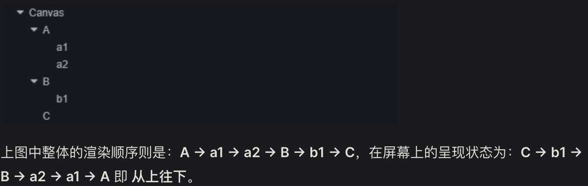
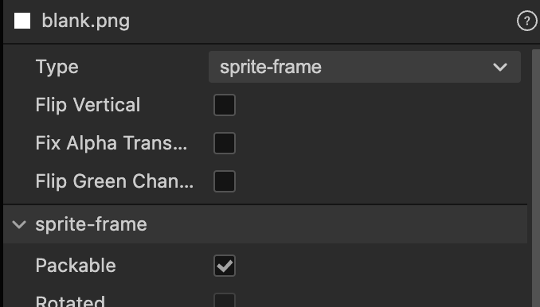
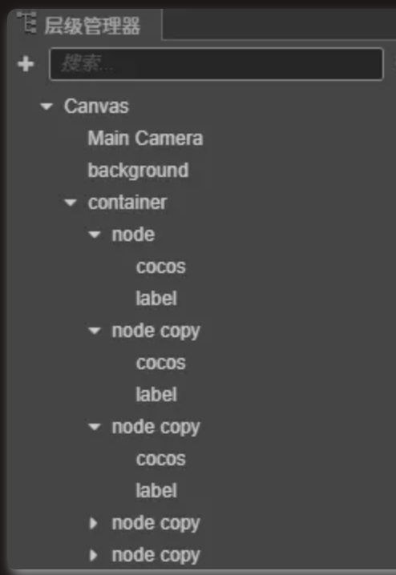
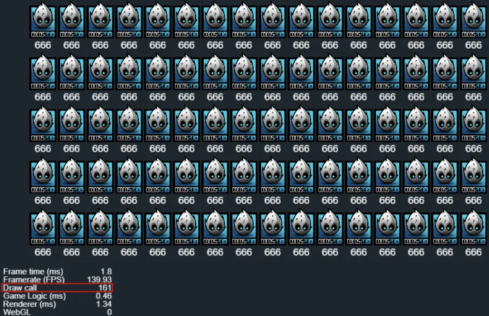
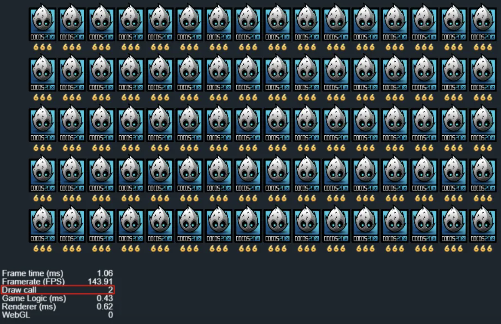
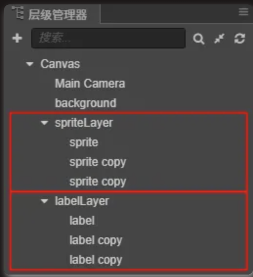
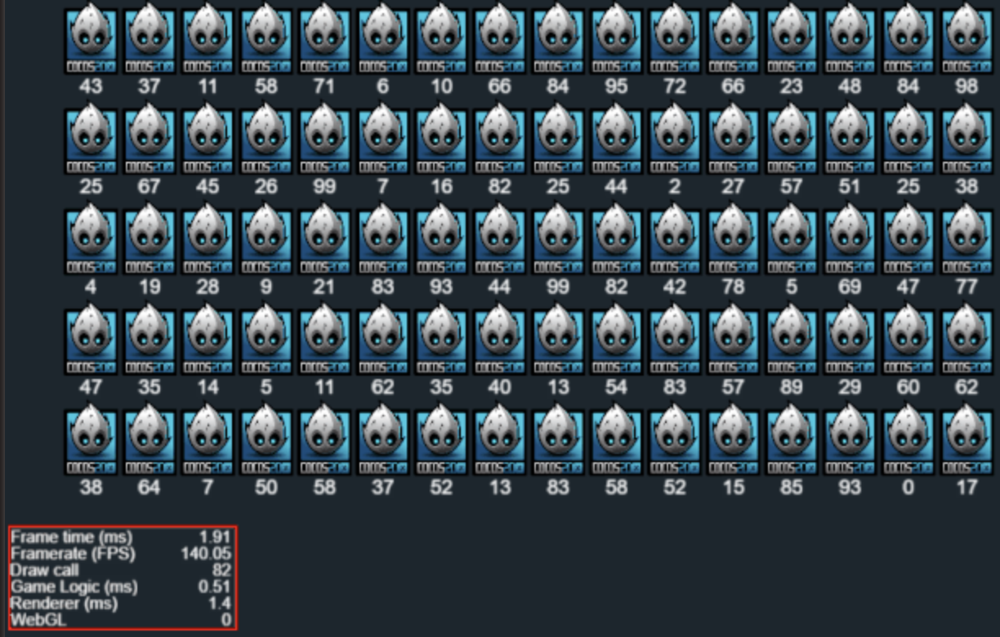
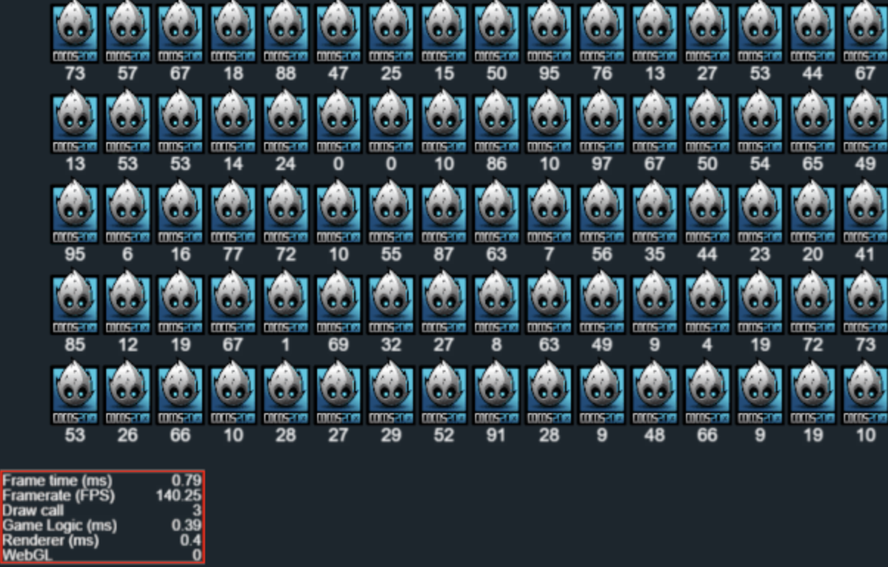

# Cocos Creator 優化 - 2D繪圖效能優化
電腦圖學 (Computer Graphics) 繪圖 (Rendering)：三角面組成模型 (Mesh)，透過材質 (Material) 指定該模型外觀 (顏色/貼圖/透明度/...)；CPU 端整理此一系列繪圖資料，使用 Graphics API (OpenGL/Vulkan/Metal/...) 傳送到 GPU (Video Memory) 端通知 GPU 完成該次繪圖渲染工作。以上過程稱為一個 Draw Call 工作完成。


## 效能問題
CPU 端先進行繪圖資料準備工作然後傳送資料到 GPU 端，GPU 等收到繪圖指令才能完成繪圖渲染工作，因此過程牽涉到 CPU - GPU 的同步等待。故 Draw Calls 越少需要做的同步工作就越少。

## Draw Call (Batches) 合併
[2D 渲染排序](https://docs.cocos.com/creator/3.8/manual/zh/ui-system/components/engine/priority.html)



Cocos Creator 引擎依照 Canvas 根節點之下子節點樹，依上至下，淺至深的順序將 2D 內容 (UIRenderer) 繪製出來。過程中如果每個 UIRenderer 都單獨送出去繪製，每個 UIRenderer 就會產生 1 新的 Draw Call。

Cocos Creator 判斷繪圖順序上多個連續的 UIRenderer 繪圖資料如果可以合併，就自動處理繪圖資料合批工作 (Merge Batches)，減少 Draw Call 工作次數。

### 合併條件
[2D 渲染合批規則](https://docs.cocos.com/creator/3.8/manual/zh/ui-system/components/engine/ui-batch.html)

2 個繪圖來源是否可合批最主要看是否共用相同的材質 (Material) 實體為原則。Mask & Graphics & UIMeshRenderer 無法與其他 2D 組件進行繪圖合批。

2D 組件中最主要的 Sprite 與 Label 組件皆使用同一套 (Sprite) Shader 進行繪圖，故他們預設使用同一個材質，決定兩者之間 Draw Call 能不能合併的關鍵變成是否使用同一張來源貼圖 (Texture)。

## Sprite 優化 - 靜態合併圖集
[自動圖集資源(Auto Atlas)](https://docs.cocos.com/creator/3.8/manual/zh/asset/auto-atlas.html)

指定資料夾路徑下(遞迴收集)所有貼圖資源，打包成同一系列的大圖集 (Build 階段才會真的打包生成圖集)。

## Label 優化
1. Font 使用 BMFont

適合固定 ASCII 字元組成的文字，該字體共用固定一張文字貼圖，此貼圖可考慮跟其他圖集一起合併。使用 BMFont 字體建議 CacheMode = NONE 。

2. CacheMode

* NONE: 不緩存，每個 Label 組件各自產生成自己的文字貼圖。
* BITMAP: 生成的文字貼圖可參與 Cocos Creator 動態合圖系統 (DynamicAtlasManager)；適合文字不變情況。
* CHAR: 將文字以字元為單位合併存進全局共享的文字合併圖集；限制：圖集大小為 1024x1024 ，圖集空間用完後新字元無法生成存進去 (畫不出來)，場景切換時會清除共享文字圖集重新開始生成；適合文字頻繁改動情況。

## Cocos Creator DynamicAtlasManager - 動態合併圖集
[DynamicAtlasManager](https://docs.cocos.com/creator/3.8/manual/zh/advanced-topics/dynamic-atlas.html)

強制啟用方式
``` TS
macro.CLEANUP_IMAGE_CACHE = false;
DynamicAtlasManager.instance.enabled = true;
```

Cocos Creator 引擎運行中動態自動將可合併的 SpriteFrame (屬性 packable = true) 合進共享的動態圖集系列，因此會消耗更多記憶體空間；預設動態圖集大小是 2048x2048 一張，單 SpriteFrame 允許被合併的大小上限是 512x512。



# 案例

1. Sprites & Labels 節點交錯，無合併圖集，Label 使用 TTF 字體




2. Label CacheMode = BITMAP，開啟 DynamicAtlasManager



3. Sprites & Labels 節點分群組節點，比較 Label CacheMode = NONE 與 CHAR



CacheMode = NONE


CacheMode = CHAR


# 參考延伸閱讀
[Cocos Creator 性能优化：DrawCall](https://mp.weixin.qq.com/s?__biz=MzI3MDQ1Mzc5MQ==&mid=2247486960&idx=1&sn=4f3dc5a7f588fb7a3cc9122369ee14da&scene=21)

[Cocos Creator 3.8 - 2D UI DrawCall优化详解（上）](https://blog.csdn.net/lizhong2008/article/details/133715903)
