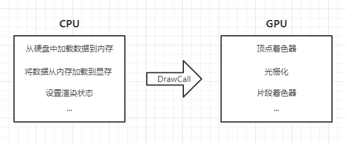

# Cocos Creator 優化 - 2D繪圖效能優化
電腦圖學 (Computer Graphics) 繪圖 (Rendering) 工作原理：三角面組成模型資料 (Mesh)，透過材質 (Material) 指定該模型如何呈現外觀 (顏色/貼圖/透明度/...)；CPU 端將這些資訊整理成一系列繪圖資料，使用 Graphics API (OpenGL/Direct3D/Vulkan/Metal/...) 將資訊傳送到 GPU (Video Memory) 端，透過繪圖指令通知 GPU 進行該組繪圖資料的繪圖渲染工作，畫到指定的螢幕區域。以上過程可稱為一個 Draw Call 工作完成。

## 效能問題
CPU 端先準備好資料準備工作，透過 Graphics API 傳送資料到 GPU 端，每次都牽涉 Memory Read/Write 與 CPU 至 GPU 狀態同步等待之過程。

# 參考延伸閱讀
[Cocos Creator 性能优化：DrawCall](https://mp.weixin.qq.com/s?__biz=MzI3MDQ1Mzc5MQ==&mid=2247486960&idx=1&sn=4f3dc5a7f588fb7a3cc9122369ee14da&scene=21)

[Cocos Creator 3.8 - 2D UI DrawCall优化详解（上）](https://blog.csdn.net/lizhong2008/article/details/133715903)
