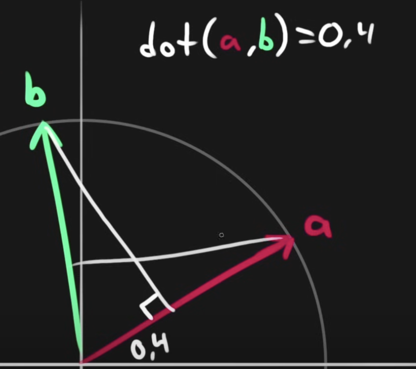
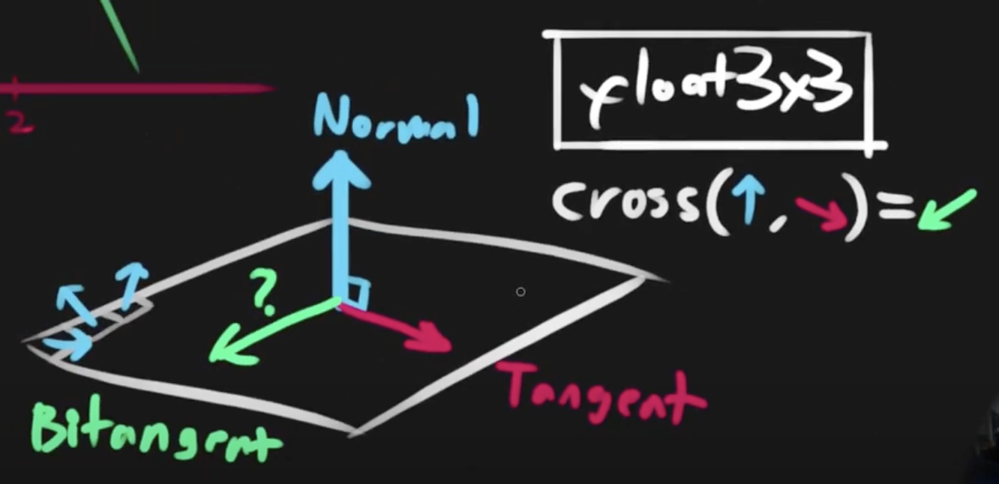

# 遊戲開發數學
## 電腦圖學 - 線性代數 - 向量
參考 wiki：http://en.wikipedia.org/wiki/Vector_(mathematics_and_physics)

向量 (Vector) 為具有大小和方向的量，電腦圖學中用在代表座標位置 ([x, y, z, 1])、線段方向 ([x, y, z, 0])、顏色 ([r, g, b, a]) 等應用情境；在遊戲開發中常用於表示位置、速度、加速度等物理量。

### 向量表示
在 3D 空間中，向量可用來表示座標：
```math
\vec{v} = 
\begin{bmatrix}
x \\
y \\
z
\end{bmatrix}
```

### 加(減)法
向量的加減法是分量相加減：
```math
\vec{a} + \vec{b} = 
\begin{bmatrix}
a_x \\
a_y \\
a_z
\end{bmatrix}
+
\begin{bmatrix}
b_x \\
b_y \\
b_z
\end{bmatrix}
=
\begin{bmatrix}
a_x + b_x \\
a_y + b_y \\
a_z + b_z
\end{bmatrix}
```

### 向量長度
向量的長度（模）表示為 |v|，計算方式為 (畢氏定理)：
```math
|\vec{v}| = \sqrt{x^2 + y^2 + z^2}
```

### 向量正規化
向量正規化是將向量轉換為單位向量（長度為 1）的過程：將向量除以自身長度
```math
\hat{v} = \frac{\vec{v}}{|\vec{v}|} = 
\begin{bmatrix}
x/|\vec{v}| \\
y/|\vec{v}| \\
z/|\vec{v}|
\end{bmatrix}
```

### 向量線性內插
Linear Interpolation，簡稱 Lerp，用在 2 向量之間進行平滑過渡：根據參數 t 在兩向量間插值
```math
\vec{lerp}(t) = (1-t)\vec{a} + t\vec{b}, \text{ where } t \in [0,1]
```

## 向量積
向量積是向量運算中最重要的操作，包含內積 (dot product) 和外積 (cross product) 兩種。

### 內積
內積的結果是一個純量（標量），計算方式為：向量長度與夾角餘弦的乘積
```math
\vec{a} \cdot \vec{b} = |a||b|\cos\theta = a_xb_x + a_yb_y + a_zb_z
```

內積的應用：
1. 計算兩向量夾角

```math
\cos\theta = \frac{\vec{a} \cdot \vec{b}}{|\vec{a}||\vec{b}|}
```

2. 計算向量投影

    計算 a 在 b 上的投影向量
    
    

```math
proj_{\vec{b}}\vec{a} = \frac{\vec{a} \cdot \vec{b}}{|\vec{b}|^2}\vec{b}
```

3. 判斷 2 個向量之間相對方向（正向、反向、垂直）

### 外積
2 個向量進行外積的結果是一個新的向量，垂直於這兩個向量：



```math
\vec{a} \times \vec{b} = 
\begin{bmatrix}
a_yb_z - a_zb_y \\
a_zb_x - a_xb_z \\
a_xb_y - a_yb_x
\end{bmatrix}
```

外積的應用：
1. 計算垂直向量

    用外積計算平面的法向量：
```math
\vec{normal} = \vec{v_1} \times \vec{v_2}
```

2. 判斷左右方向

## 開發應用

1. 兩點之間差異

    使用向量減法計算兩點間的相對位置： B 點指向 A 點的向量
```math
\vec{diff} = P_A - P_B = 
\begin{bmatrix}
x_A - x_B \\
y_A - y_B \\
z_A - z_B
\end{bmatrix}
```

常用於：物體間的相對位置，計算移動方向

2. 物體朝向判斷
使用內積判斷物體是否面向目標：
```math
\cos\theta = \frac{\vec{forward} \cdot \vec{toTarget}}{|\vec{forward}||\vec{toTarget}|}
```

3. 相機控制

    使用外積計算相機的上方向：
```math
\vec{up} = \vec{forward} \times \vec{right}
```

4. 碰撞檢測

    使用內積和外積進行碰撞檢測：計算兩物體中心點的距離向量
```math
\vec{distance} = P_2 - P_1
```

計算碰撞法向量，用於反彈計算

```math
\vec{normal} = \vec{distance} \times \vec{velocity}
```
當兩物體中心距離小於半徑和時發生碰撞

```math
|\vec{distance}| < (r_1 + r_2) \text{ 表示發生碰撞}
```

5. 向量內插計算達到動畫過渡

    情境如物體平滑移動，顏色漸變，相機平滑跟隨