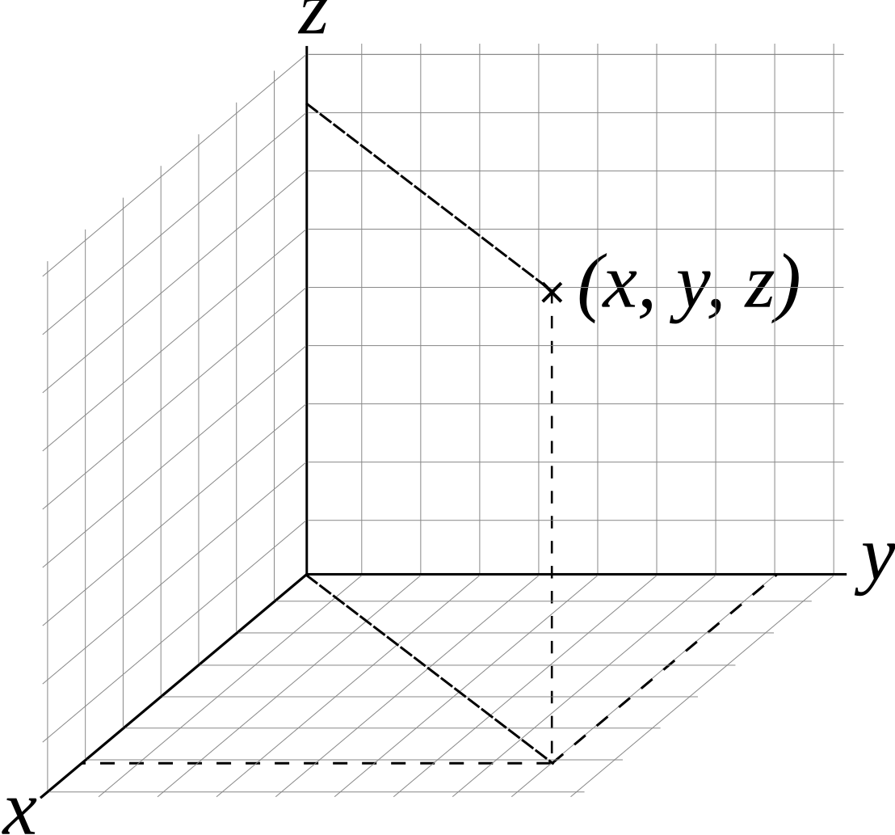
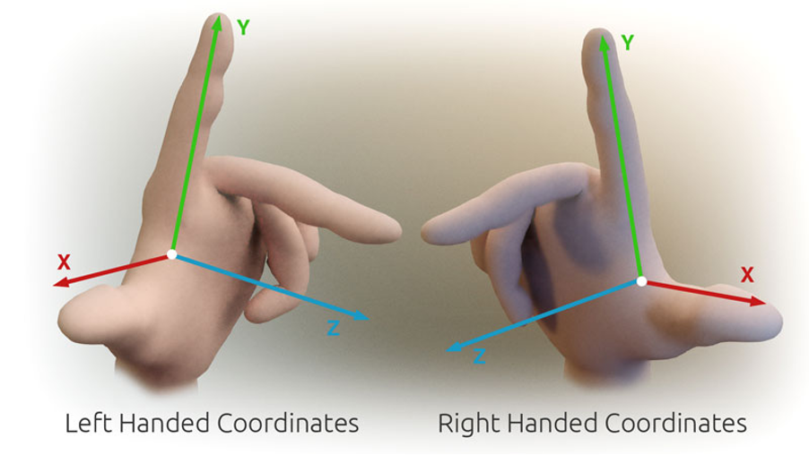

# 遊戲開發數學
## 電腦圖學 - 線性代數 - 座標系統
參考 wiki：http://en.wikipedia.org/wiki/Coordinate_system

座標（Coordinate）是用來描述或標示某點在空間中絕對位置的有序數組。座標系（Coordinate System）是一特定的位置註記系統，用以確定某點或某目標的空間位置。

### 笛卡爾座標系統 Cartesian Coordinate System


最常用的 3D 座標系統，由三個相互垂直的軸組成：
- X 軸：通常代表左右方向
- Y 軸：通常代表上下方向  
- Z 軸：通常代表前後方向

座標空間分為左手座標系統與右手座標系統：
- 左手座標系統：X軸向右，Y軸向上，Z軸向前
- 右手座標系統：X軸向右，Y軸向上，Z軸向後



### 齊次座標 Homogeneous Coordinate
電腦圖學 (Computer Graphics) 中使用 4 維向量來表示 3D 座標，稱為齊次座標：
```math
\begin{aligned}
位置座標 &= \begin{bmatrix} x \\ y \\ z \\ 1 \end{bmatrix} \\
方向向量 &= \begin{bmatrix} x \\ y \\ z \\ 0 \end{bmatrix} \\
\\
第四個分量\ w\ 的意義： \\
w &= 1：表示位置點\ (Point) \\
w &= 0：表示方向向量\ (Vector)
\end{aligned}
```

為什麼使用齊次座標？

**1. 統一矩陣運算**

使用 4x4 矩陣可以將所有幾何轉換統一為矩陣乘法：位移 + 旋轉 + 縮放 = 組合成單一 4x4 矩陣運算

**2. 有效表示位移變換**

3x3 矩陣無法表示位移變換，但 4x4 矩陣可以：

**3. 區分點與向量**

在幾何運算中，點和方向向量的行為不同：

- **點 (Point)**：有位置，會受位移影響
- **向量 (Vector)**：只有方向和大小，不受位移影響

**4. 簡化投影運算**

透視投影需要進行除法運算，齊次座標讓這個過程更自然：

```math
投影後的齊次座標
\begin{bmatrix} x' \\ y' \\ z' \\ w' \end{bmatrix} \\
透視除法得到實際 3D 座標
\begin{bmatrix} x'/w' \\ y'/w' \\ z'/w' \end{bmatrix}
```

## 座標空間 Coordinate Space
座標空間 (Coordinate Space) 是指用於定義物件位置和方向的參照系統。 它包含一個原點（Origin），以及定義方向和比例的座標軸 (Axes)。

## 座標空間轉換

空間轉換是將座標從一個座標空間轉換到另一個座標空間的過程。Computer Graphics 中，我們使用轉換矩陣 (Transformation Matrix) 來完成這些轉換操作。

### 基本轉換矩陣

所有的空間轉換都可以用 4x4 矩陣來表示，由以下基本轉換可以組合成複雜的變換：
- **位移矩陣 (Translation Matrix)**
- **縮放矩陣 (Scaling Matrix)**
- **旋轉矩陣 (Rotation Matrix)**

多個轉換可以透過矩陣相乘組合成單一矩陣。**注意：矩陣乘法的順序很重要！**

```math
\begin{aligned}
M_{combined} &= M_{translation} \times M_{rotation} \times M_{scaling} \\
&= T \times R \times S
\end{aligned}
```

這個順序表示：先縮放 → 再旋轉 → 最後位移（TRS 順序）

### 轉換矩陣的運作原理

轉換矩陣的每個元素都有特定的作用：

```math
\begin{bmatrix}
x軸方向 & y軸方向 & z軸方向 & 位移 \\
x軸方向 & y軸方向 & z軸方向 & 位移 \\
x軸方向 & y軸方向 & z軸方向 & 位移 \\
0 & 0 & 0 & 1
\end{bmatrix}
```

- **左上角 3x3 區塊**：控制旋轉和縮放
- **右上角 3x1 區塊**：控制位移
- **底部一列**：保持齊次座標的正確性

### 逆變換 (Inverse Transform)

要進行反向轉換，需要使用逆矩陣：

```math
\begin{aligned}
M_{model} &= T \times R \times S \\
P_{object} &= M_{model}^{-1} \times P_{world} \\
M_{model}^{-1} &= S^{-1} \times R^{-1} \times T^{-1}
\end{aligned}
```

**注意**：逆變換的順序與原變換相反！

## Affine Transformation

## 開發應用

# 參考延伸閱讀

[座標系](https://zh.wikipedia.org/wiki/%E5%9D%90%E6%A8%99%E7%B3%BB)

[笛卡爾座標系統](https://zh.wikipedia.org/wiki/%E7%AC%9B%E5%8D%A1%E5%84%BF%E5%9D%90%E6%A0%87%E7%B3%BB)

[3D Math Primer for Graphics and Game Development](https://gamemath.com/)

[Real-Time Rendering, 4th Edition](http://www.realtimerendering.com/)

[Mathematics for 3D Game Programming and Computer Graphics](https://mathfor3dgameprogramming.com/)
