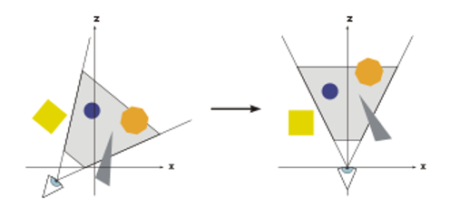
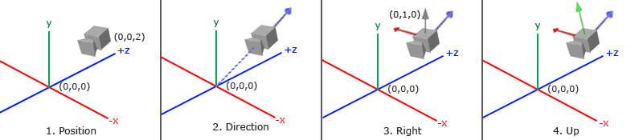

# 遊戲開發數學
## 電腦圖學 - 空間轉換 - View Matrix

View Matrix 是將頂點座標從 World Space 轉換至 Camera Space 的 4x4 轉換矩陣。


## Camera Space



Camera Space 以攝影機位置為原點，以攝影機自身的三個正交軸為座標軸：

- **X 軸（Right）**：攝影機的右方向
- **Y 軸（Up）**：攝影機的上方向
- **Z 軸（Forward/Look）**：攝影機的前方向

右手座標系 (OpenGL、Cocos Creator) 中攝影機朝 $-Z$ 方向看；左手座標系 (DirectX) 中攝影機朝 $+Z$ 方向看。

### View Matrix 轉換

攝影機在 World Space 中有自己的位移與旋轉，可表示成 Model Matrix：

```math
\begin{aligned}
M_{camera} &= T \times R
\end{aligned}
```

View Matrix 即是將整個世界「反向」移動到攝影機面前——也就是攝影機 World Transform 的逆矩陣：

```math
\begin{aligned}
V &= M_{camera}^{-1} = (T \times R)^{-1} = R^{-1} \times T^{-1} = R^{T} \times T^{-1}
\end{aligned}
```

旋轉矩陣為正交矩陣（Orthogonal Matrix），逆矩陣等於轉置矩陣（$R^{-1} = R^{T}$），前一篇座標空間已說明。

### 建構 View Matrix

實務上使用 LookAt 函式，以三個參數描述攝影機狀態：
- **Eye**：攝影機在 World Space 的位置
- **Focus**：攝影機注視的目標點
- **WorldUp**：世界的上方向參考向量，通常為 $(0, 1, 0)$

### 推導攝影機座標軸

由 Eye、Focus、WorldUp 推導攝影機的三個正交座標軸：

```math
\begin{aligned}
\vec{f} &= \text{normalize}(Focus - Eye) & \text{(Forward：看向方向)} \\
\vec{r} &= \text{normalize}(\vec{f} \times WorldUp) & \text{(Right：右方向，外積求垂直)} \\
\vec{u} &= \vec{r} \times \vec{f} & \text{(Up：重新外積保證正交)}
\end{aligned}
```



### 右手座標系

攝影機旋轉矩陣的各欄為攝影機座標軸（右手系中 Forward 存入時取負號，因攝影機朝 $-Z$）：

```math
R = \begin{bmatrix}
r_x & u_x & -f_x & 0 \\
r_y & u_y & -f_y & 0 \\
r_z & u_z & -f_z & 0 \\
0   & 0   &  0   & 1
\end{bmatrix}
```

View Matrix = $R^{T} \times T(-Eye)$，展開計算：

```math
\begin{aligned}
V_{RH} &= R^{T} \times T(-Eye) \\[6pt]
&=
\begin{bmatrix}
 r_x &  r_y &  r_z & 0 \\
 u_x &  u_y &  u_z & 0 \\
-f_x & -f_y & -f_z & 0 \\
 0   &  0   &  0   & 1
\end{bmatrix}
\times
\begin{bmatrix}
1 & 0 & 0 & -E_x \\
0 & 1 & 0 & -E_y \\
0 & 0 & 1 & -E_z \\
0 & 0 & 0 &  1
\end{bmatrix} \\[6pt]
&=
\begin{bmatrix}
 r_x  &  r_y  &  r_z  & -\vec{r} \cdot Eye \\
 u_x  &  u_y  &  u_z  & -\vec{u} \cdot Eye \\
-f_x  & -f_y  & -f_z  &  \vec{f} \cdot Eye \\
 0    &  0    &  0    &  1
\end{bmatrix}
\end{aligned}
```

最後一欄為各軸向量與 Eye 位置的內積（Dot Product），代表攝影機位置在該軸上的投影分量，取負號完成反向位移。

### 左手座標系

左手座標系（DirectX）攝影機朝 $+Z$，叉積順序不同，Forward 不取負號：

```math
\begin{aligned}
\vec{f} &= \text{normalize}(Target - Eye) \\
\vec{r} &= \text{normalize}(WorldUp \times \vec{f}) \\
\vec{u} &= \vec{f} \times \vec{r}
\end{aligned}
```

```math
V_{LH} = \begin{bmatrix}
r_x  &  r_y  &  r_z  & -\vec{r} \cdot Eye \\
u_x  &  u_y  &  u_z  & -\vec{u} \cdot Eye \\
f_x  &  f_y  &  f_z  & -\vec{f} \cdot Eye \\
0    &  0    &  0    &  1
\end{bmatrix}
```

## 實作

CPU 端計算 LookAt View Matrix（右手座標系），每幀計算一次作為 Uniform 傳入 GPU：

```TypeScript
// pseudo-code: LookAt View Matrix (右手座標系)
function lookAt(eye: vec3, focus: vec3, worldUp: vec3): mat4 {
    const f = normalize(focus - eye);      // Forward
    const r = normalize(cross(f, worldUp)); // Right
    const u = cross(r, f);                  // Up

    return mat4(
         r.x,          u.x,         -f.x,         0.0,
         r.y,          u.y,         -f.y,         0.0,
         r.z,          u.z,         -f.z,         0.0,
        -dot(r, eye), -dot(u, eye),  dot(f, eye), 1.0
    );
}
```

Vertex Shader 中完成 World → Camera → Clip 轉換：

```glsl
// Vertex Shader
uniform mat4 u_model;
uniform mat4 u_view;
uniform mat4 u_projection;

attribute vec3 a_position;

void main() {
    gl_Position = u_projection * u_view * u_model * vec4(a_position, 1.0);
}
```

### 管線階段

- **CPU 端（Application Stage）**：每幀根據攝影機位置與朝向計算 View Matrix，作為 Uniform 傳送至 GPU。View Matrix 整個場景共用，不隨繪圖物件而改變。
- **GPU 端（Vertex Shader）**：每個頂點乘以 View Matrix 完成 World Space → Camera Space 轉換。實務上常將 Model × View × Projection 預先合併為 MVP Matrix，Vertex Shader 只需一次矩陣乘法。

# 參考延伸閱讀

[OpenGL Camera - Song Ho](http://www.songho.ca/opengl/gl_camera.html)

[Learn OpenGL - Camera](https://learnopengl.com/Getting-started/Camera)
