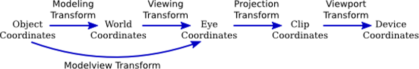
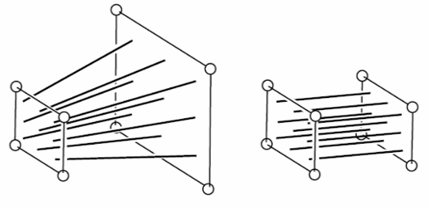
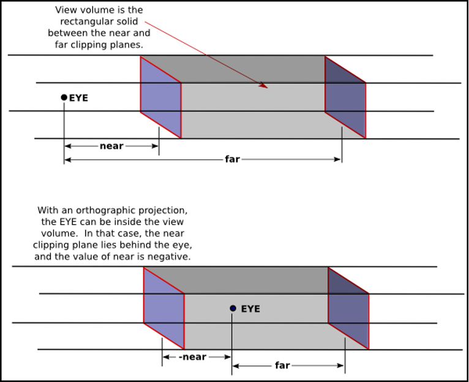
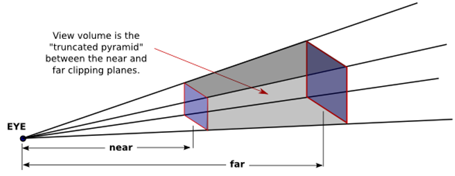
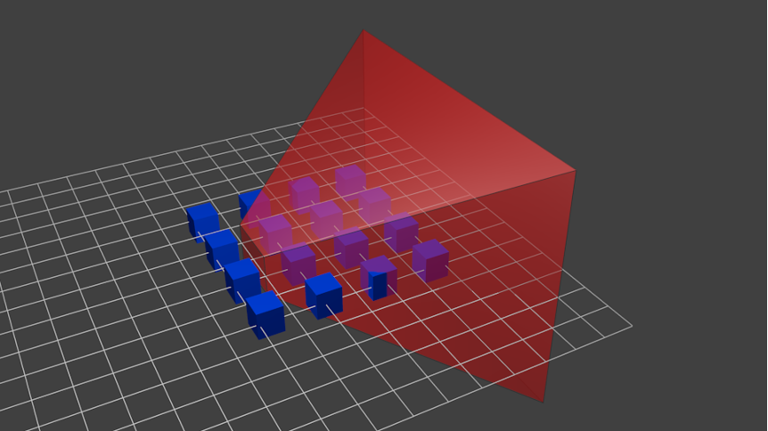

# 遊戲開發數學
## 電腦圖學 - 空間轉換 - Projection Matrix

Projection Matrix 是將頂點座標從 Camera Space 轉換至 Clip Space 的 4×4 轉換矩陣。它透過定義相機的「可見範圍」（View Frustum），決定哪些物件應該被繪製，同時也為後續的透視效果與深度計算提供必要的資訊。



## 為什麼需要 Projection Matrix？

經過 View Matrix 轉換後，頂點已處於 Camera Space，但此時的座標仍然是真實的 3D 世界單位（公尺、公分等），GPU 無法直接用這些座標決定「哪些東西該畫在螢幕上、畫在哪裡」。

Projection Matrix 的工作就是：

1. **定義可視範圍**：透過 Near/Far Plane、Field of View 等參數界定 View Frustum (視錐體)，只有在此範圍內的物件才會被繪製。
2. **映射到標準化空間**：將 View Frustum 內的座標壓縮（映射）到一個固定大小的標準化空間——NDC (Normalized Device Coordinates)，讓 GPU 可以統一處理。
3. **編碼深度資訊**：將 Z 值映射到 $[0, 1]$ 或 $[-1, 1]$ 的範圍，供 Depth Buffer (深度緩衝區) 進行遮擋判斷。
4. **為透視效果做準備**（僅 Perspective 投影）：利用齊次座標的 $w$ 分量，讓遠處的物件在螢幕上看起來更小（近大遠小）。

簡單比喻：如果 View Matrix 是「把攝影機擺好位置」，Projection Matrix 就是「調整鏡頭焦距與取景範圍」。

## Clip Space 與 NDC

### Clip Space (裁剪空間)

頂點乘以 Projection Matrix 後進入 Clip Space。此時座標為齊次座標 $(x, y, z, w)$，GPU 在此階段執行 Clipping（裁剪超出視錐體的面）。

Clip Space 中的可見範圍判定條件：

```math
\begin{aligned}
-w &\leq x \leq w \\
-w &\leq y \leq w \\
-w &\leq z \leq w \quad &\text{(OpenGL)} \\
 0 &\leq z \leq w \quad &\text{(DirectX / Vulkan / Metal)}
\end{aligned}
```

### NDC (Normalized Device Coordinates)

Clipping 完成後，GPU 執行 **Perspective Division（透視除法）**，將齊次座標除以 $w$：

```math
\begin{aligned}
\begin{bmatrix} x_{ndc} \\ y_{ndc} \\ z_{ndc} \end{bmatrix}
&= \begin{bmatrix} x / w \\ y / w \\ z / w \end{bmatrix}
\end{aligned}
```

除法後得到 NDC，所有可見頂點落在固定的標準化範圍內：

| API | X 範圍 | Y 範圍 | Z 範圍 |
|-----|--------|--------|--------|
| OpenGL | $[-1, 1]$ | $[-1, 1]$ | $[-1, 1]$ |
| DirectX / Vulkan / Metal | $[-1, 1]$ | $[-1, 1]$ | $[0, 1]$ |

**Pipeline Context**：Projection Matrix 的乘法在 **Vertex Shader** 中完成（通常與 Model、View 矩陣合併為 MVP Matrix）。Clipping 與 Perspective Division 則由 GPU **Fixed-Function 硬體**在 Vertex Shader 之後、Rasterization 之前自動執行。

## 兩種投影方式



電腦圖學中有兩種主要的投影方式：

| 比較 | Orthographic (正交投影) | Perspective (透視投影) |
|------|------------------------|----------------------|
| 視覺效果 | 無近大遠小，平行線保持平行 | 有近大遠小，模擬人眼視覺 |
| View Frustum 形狀 | 長方體 (Box) | 截頂四角錐 (Truncated Pyramid) |
| 典型用途 | 2D 遊戲、UI、建築 CAD、工程圖 | 3D 遊戲、電影、VR |
| $w$ 分量 | 保持為 $1$（無透視效果） | 被設為 $-z$ 或 $z$（產生透視效果） |

## Orthographic Projection (正交投影)



Orthographic Projection 將一個軸對齊的長方體空間（由 left, right, bottom, top, near, far 六個參數定義）**線性映射**到 NDC 。因為不改變 $w$ 分量（保持為 1），所以沒有近大遠小的效果。

### 直觀理解

想像你用一台「沒有鏡頭」的平行光照相機拍照——光線全部平行射入，不會匯聚。不管物體距離攝影機多遠，在螢幕上的尺寸都一樣。正交投影要做的事情很單純：

1. **位移**：把長方體的中心移到原點
2. **縮放**：把長方體壓縮到 $[-1, 1]^3$（或 $[-1, 1]^2 \times [0, 1]$）的標準立方體

### 參數定義

- $l$ (left)：左邊界
- $r$ (right)：右邊界
- $b$ (bottom)：下邊界
- $t$ (top)：上邊界
- $n$ (near)：近平面距離（正值）
- $f$ (far)：遠平面距離（正值，$f > n$）

### 推導過程

以 X 軸為例說明映射邏輯，目標是將 $[l, r]$ 線性映射到 $[-1, 1]$：

**步驟一：位移，將區間中心移到原點**

```math
\begin{aligned}
x' &= x - \frac{r + l}{2}
\end{aligned}
```

此時 X 的範圍為 $\left[-\frac{r-l}{2},\ \frac{r-l}{2}\right]$。

**步驟二：縮放，將區間壓縮到 $[-1, 1]$**

```math
\begin{aligned}
x_{ndc} &= x' \times \frac{2}{r - l} = \frac{2x}{r - l} - \frac{r + l}{r - l}
\end{aligned}
```

同理可得 Y 軸映射。Z 軸的映射依 API 不同有兩種情況（見下方矩陣）。

### 右手座標系 (OpenGL)

右手座標系中攝影機朝 $-Z$ 方向看，Camera Space 中的 Near Plane 位於 $z = -n$，Far Plane 位於 $z = -f$。

Z 軸需要將 $[-n, -f]$ 映射到 $[-1, 1]$（OpenGL NDC z 範圍）：

```math
\begin{aligned}
z_{ndc} &= \frac{-2}{f - n} \cdot z - \frac{f + n}{f - n}
\end{aligned}
```

完整矩陣：

```math
P_{ortho}^{RH} = \begin{bmatrix}
\dfrac{2}{r - l} & 0 & 0 & -\dfrac{r + l}{r - l} \\[6pt]
0 & \dfrac{2}{t - b} & 0 & -\dfrac{t + b}{t - b} \\[6pt]
0 & 0 & \dfrac{-2}{f - n} & -\dfrac{f + n}{f - n} \\[6pt]
0 & 0 & 0 & 1
\end{bmatrix}
```

**對稱視錐體簡化**：當 $l = -r$，$b = -t$ 時（中心對稱），矩陣簡化為：

```math
P_{ortho}^{RH} = \begin{bmatrix}
\dfrac{1}{r} & 0 & 0 & 0 \\[6pt]
0 & \dfrac{1}{t} & 0 & 0 \\[6pt]
0 & 0 & \dfrac{-2}{f - n} & -\dfrac{f + n}{f - n} \\[6pt]
0 & 0 & 0 & 1
\end{bmatrix}
```

### 左手座標系 (DirectX)

左手座標系中攝影機朝 $+Z$ 方向看，Near Plane 位於 $z = n$，Far Plane 位於 $z = f$。

Z 軸需要將 $[n, f]$ 映射到 $[0, 1]$（DirectX NDC z 範圍）：

```math
\begin{aligned}
z_{ndc} &= \frac{1}{f - n} \cdot z - \frac{n}{f - n}
\end{aligned}
```

完整矩陣：

```math
P_{ortho}^{LH} = \begin{bmatrix}
\dfrac{2}{r - l} & 0 & 0 & -\dfrac{r + l}{r - l} \\[6pt]
0 & \dfrac{2}{t - b} & 0 & -\dfrac{t + b}{t - b} \\[6pt]
0 & 0 & \dfrac{1}{f - n} & -\dfrac{n}{f - n} \\[6pt]
0 & 0 & 0 & 1
\end{bmatrix}
```

### 小結

| 組合 | Z 輸入範圍 | Z 輸出範圍 | Z 縮放因子 |
|------|-----------|-----------|-----------|
| RH + OpenGL | $[-n, -f]$ | $[-1, 1]$ | $\frac{-2}{f-n}$ |
| LH + DirectX | $[n, f]$ | $[0, 1]$ | $\frac{1}{f-n}$ |

## Perspective Projection (透視投影)



Perspective Projection 模擬人眼的視覺效果：離攝影機越近的物體看起來越大，越遠的越小。它將一個截頂四角錐 (Frustum) 的空間映射到 NDC 的標準立方體中。

### 直觀理解

想像你站在筆直的鐵軌上往前看——兩條平行的鐵軌在遠方匯聚到一個消失點 (Vanishing Point)。這就是透視效果。

透視投影的核心原理是：**將 $x$ 和 $y$ 除以 $z$ 的某個倍數**，距離越遠（$z$ 越大），除出來的值越小，物體在螢幕上就越小。齊次座標的 $w$ 分量正好提供了一個優雅的機制來實現這件事——Projection Matrix 將 $w$ 設定為與 $z$ 相關的值，GPU 在後續的透視除法中自動完成「除以 $z$」的操作。

### 參數定義

Perspective 投影通常使用以下參數：

- **fov** (Field of View)：垂直視野角度（弧度），常見值約 45°~90°
- **aspect**：螢幕寬高比 $= \dfrac{width}{height}$
- **$n$ (near)**：近平面距離（正值）
- **$f$ (far)**：遠平面距離（正值，$f > n$）

透過 fov 與 aspect 可以推算出 Near Plane 上的邊界：

```math
\begin{aligned}
t &= n \cdot \tan\!\left(\frac{fov}{2}\right) \quad &\text{(top)} \\
b &= -t \quad &\text{(bottom)} \\
r &= t \cdot aspect \quad &\text{(right)} \\
l &= -r \quad &\text{(left)}
\end{aligned}
```

### 推導過程



推導的核心思路是：對於 Frustum 中的任意一點 $(x, y, z)$，找出它投影到 Near Plane 上的座標，再將投影後的座標映射到 NDC。

**步驟一：透視投影——利用相似三角形**

以右手座標系為例，攝影機朝 $-Z$ 方向看，Near Plane 在 $z = -n$。觀察 YZ 平面上的側視圖，由相似三角形可得：

```math
\begin{aligned}
\frac{y_{proj}}{n} &= \frac{y}{-z} \quad \Rightarrow \quad y_{proj} = \frac{-n \cdot y}{z} = \frac{n \cdot y}{-z}
\end{aligned}
```

同理 X 軸：

```math
\begin{aligned}
x_{proj} &= \frac{n \cdot x}{-z}
\end{aligned}
```

這裡除以 $-z$（而非 $z$）是因為右手座標系中物體在攝影機前方的 $z$ 值為負數。

**步驟二：映射到 NDC**

接著將投影座標映射到 $[-1, 1]$：

```math
\begin{aligned}
x_{ndc} &= \frac{2 \cdot x_{proj}}{r - l} - \frac{r + l}{r - l} \\[6pt]
&= \frac{2n \cdot x}{-z(r - l)} - \frac{r + l}{r - l}
\end{aligned}
```

**步驟三：利用齊次座標的 $w$ 分量**

我們希望透視除法（除以 $w$）自動完成「除以 $-z$」的操作。因此令 $w' = -z$，把整個結果乘以 $-z$ 回去，讓矩陣乘法先輸出 Clip Space 座標，GPU 再除以 $w$。

這決定了矩陣第四列的設計為 $(0,\ 0,\ -1,\ 0)$，使得 $w' = -z$。

**步驟四：Z 值映射**

Z 的映射比較特殊，因為透視投影的 Z 映射是**非線性**的。我們需要找到 $A$ 和 $B$ 使得：

```math
\begin{aligned}
z_{ndc} &= \frac{Az + B}{-z}
\end{aligned}
```

利用邊界條件求解：

- 當 $z = -n$ 時，$z_{ndc} = -1$（OpenGL 近平面映射到 $-1$）
- 當 $z = -f$ 時，$z_{ndc} = 1$（OpenGL 遠平面映射到 $1$）

```math
\begin{aligned}
z = -n:& \quad \frac{A(-n) + B}{n} = -1 \quad \Rightarrow \quad -An + B = -n \\[4pt]
z = -f:& \quad \frac{A(-f) + B}{f} = 1 \quad \Rightarrow \quad -Af + B = f
\end{aligned}
```

兩式相減解出 $A$ 和 $B$：

```math
\begin{aligned}
A &= \frac{f + n}{f - n}, \quad B = \frac{2fn}{f - n}
\end{aligned}
```

### 右手座標系 (OpenGL)

完整的 Perspective Projection Matrix（對稱視錐體，$l = -r$，$b = -t$）：

```math
P_{persp}^{RH} = \begin{bmatrix}
\dfrac{n}{r} & 0 & 0 & 0 \\[6pt]
0 & \dfrac{n}{t} & 0 & 0 \\[6pt]
0 & 0 & -\dfrac{f + n}{f - n} & -\dfrac{2fn}{f - n} \\[6pt]
0 & 0 & -1 & 0
\end{bmatrix}
```

以 fov 和 aspect 表示（更常見的形式）：

```math
P_{persp}^{RH} = \begin{bmatrix}
\dfrac{1}{aspect \cdot \tan(fov/2)} & 0 & 0 & 0 \\[6pt]
0 & \dfrac{1}{\tan(fov/2)} & 0 & 0 \\[6pt]
0 & 0 & -\dfrac{f + n}{f - n} & -\dfrac{2fn}{f - n} \\[6pt]
0 & 0 & -1 & 0
\end{bmatrix}
```

### 左手座標系 (DirectX)

左手座標系中攝影機朝 $+Z$ 方向看，Near Plane 在 $z = n$，物體在相機前方 $z$ 值為正。

此時 $w' = z$（而非 $-z$），且 Z 要映射到 $[0, 1]$（DirectX NDC z 範圍）。

邊界條件：
- 當 $z = n$ 時，$z_{ndc} = 0$
- 當 $z = f$ 時，$z_{ndc} = 1$

求解得到：

```math
\begin{aligned}
A &= \frac{f}{f - n}, \quad B = \frac{-fn}{f - n}
\end{aligned}
```

完整矩陣：

```math
P_{persp}^{LH} = \begin{bmatrix}
\dfrac{1}{aspect \cdot \tan(fov/2)} & 0 & 0 & 0 \\[6pt]
0 & \dfrac{1}{\tan(fov/2)} & 0 & 0 \\[6pt]
0 & 0 & \dfrac{f}{f - n} & -\dfrac{fn}{f - n} \\[6pt]
0 & 0 & 1 & 0
\end{bmatrix}
```

### Z 值的非線性分佈

Perspective 投影的 Z 映射有一個重要特性：**靠近 Near Plane 的區域佔用了大部分的 Z 精度，遠處的 Z 精度非常低**。

```math
\begin{aligned}
z_{ndc} &= \frac{f + n}{f - n} + \frac{2fn}{(f - n) \cdot z} \quad \text{(RH OpenGL, 注意 $z < 0$)}
\end{aligned}
```

這是一條反比例曲線而非直線，導致：
- 當 $n = 0.1$，$f = 1000$ 時，前 50% 的 Z 精度集中在距離攝影機最近的約 $0.1$ 單位內
- 遠處的物體之間 Z 值差異極小，容易產生 **Z-Fighting**（深度衝突）——兩個距離相近的表面因為 Z 精度不足而交替閃爍

### 緩解 Z-Fighting 的基本做法

- **Near Plane 不要設太小**：$n = 0.1$ 比 $n = 0.001$ 好很多，精度差異可達數個數量級
- **縮小 Near/Far 的比值**：$f/n$ 比值越小，Z 精度分佈越均勻
- **使用浮點數 Depth Buffer**：32-bit 浮點 Depth Buffer 比 24-bit 整數有更好的精度分佈

## 投影矩陣總覽

### Orthographic

| | 右手座標系 (OpenGL, NDC z $\in [-1,1]$) | 左手座標系 (DirectX, NDC z $\in [0,1]$) |
|---|---|---|
| Z 輸入 | $[-n, -f]$ | $[n, f]$ |
| $w$ 輸出 | $1$ | $1$ |
| Z 行 | $(0,\ 0,\ \frac{-2}{f-n},\ -\frac{f+n}{f-n})$ | $(0,\ 0,\ \frac{1}{f-n},\ -\frac{n}{f-n})$ |

### Perspective

| | 右手座標系 (OpenGL, NDC z $\in [-1,1]$) | 左手座標系 (DirectX, NDC z $\in [0,1]$) |
|---|---|---|
| Z 輸入 | $[-n, -f]$ | $[n, f]$ |
| $w$ 輸出 | $-z$ | $z$ |
| Z 行 | $(0,\ 0,\ -\frac{f+n}{f-n},\ -\frac{2fn}{f-n})$ | $(0,\ 0,\ \frac{f}{f-n},\ -\frac{fn}{f-n})$ |
| 第四列 | $(0,\ 0,\ -1,\ 0)$ | $(0,\ 0,\ 1,\ 0)$ |

## 實作

CPU 端構建 Perspective Projection Matrix（右手座標系），作為 Uniform 傳入 GPU：

```TypeScript
// pseudo-code: Perspective Projection Matrix (右手座標系, OpenGL)
function perspective(fov: number, aspect: number, near: number, far: number): mat4 {
    const tanHalfFov = Math.tan(fov / 2);

    return mat4(
        1 / (aspect * tanHalfFov), 0,              0,                                0,
        0,                         1 / tanHalfFov,  0,                                0,
        0,                         0,              -(far + near) / (far - near),      -1,
        0,                         0,              -(2 * far * near) / (far - near),   0
    );
}
```

Vertex Shader 中完成 Camera Space → Clip Space 轉換：

```glsl
// Vertex Shader
uniform mat4 u_model;
uniform mat4 u_view;
uniform mat4 u_projection;

attribute vec3 a_position;

void main() {
    // Model → World → Camera → Clip
    gl_Position = u_projection * u_view * u_model * vec4(a_position, 1.0);
    // GPU 在後續 Fixed-Function 階段自動執行：
    // 1. Clipping（裁剪超出 Clip Space 的三角形）
    // 2. Perspective Division（除以 w，得到 NDC）
    // 3. Viewport Transform（映射到螢幕座標）
}
```

## 管線階段

完整的座標轉換流程與各階段負責的管線單元：

| 轉換 | 輸入空間 | 輸出空間 | 執行者 |
|------|---------|---------|--------|
| Model Matrix | Object Space | World Space | Vertex Shader |
| View Matrix | World Space | Camera Space | Vertex Shader |
| **Projection Matrix** | **Camera Space** | **Clip Space** | **Vertex Shader** |
| Clipping | Clip Space | Clip Space | Fixed-Function 硬體 |
| Perspective Division | Clip Space | NDC | Fixed-Function 硬體 |
| Viewport Transform | NDC | Screen Space | Fixed-Function 硬體 |

- **CPU 端（Application Stage）**：每幀根據 FOV、Aspect Ratio、Near/Far 等參數計算 Projection Matrix，通常只有在這些參數改變時才需要重新計算（例如視窗大小調整）。作為 Uniform 傳入 GPU。
- **GPU 端（Vertex Shader）**：每個頂點乘以 Projection Matrix 完成 Camera Space → Clip Space 轉換。實務上常將 Model × View × Projection 預先合併為 MVP Matrix，Vertex Shader 只需一次矩陣乘法。
- **GPU 端（Fixed-Function）**：Clipping 與 Perspective Division 由硬體自動完成，開發者無需（也無法）手動介入。

## 效能優化

- **避免過大的 $f/n$ 比值**：$f/n$ 比值越大，Depth Buffer 中的 Z 精度分佈越不均勻，容易導致 Z-Fighting。建議 $f/n < 10000$。
- **MVP 矩陣合併**：將 Model × View × Projection 預先在 CPU 端合併為一個 MVP 矩陣，Vertex Shader 中只需一次 mat4 × vec4 運算，減少 GPU ALU 計算量。
- **Projection Matrix 快取**：Projection Matrix 只在參數改變時需要重新計算，可快取結果避免每幀重複運算。
- **適當設定 Near Plane**：Near Plane 距離設得越大（在視覺上可接受的範圍內），Z 精度分佈越好，也能減少因 Z-Fighting 而產生的渲染瑕疵。

# 參考延伸閱讀

[OpenGL Projection Matrix - Song Ho](http://www.songho.ca/opengl/gl_projectionmatrix.html)

[Learn OpenGL - Coordinate Systems](https://learnopengl.com/Getting-started/Coordinate-Systems)

[Scratchapixel - The Perspective and Orthographic Projection Matrix](https://www.scratchapixel.com/lessons/3d-basic-rendering/perspective-and-orthographic-projection-matrix/projection-matrix-introduction.html)

[Microsoft DirectX - D3DXMatrixPerspectiveFovLH](https://learn.microsoft.com/en-us/windows/win32/direct3d9/d3dxmatrixperspectivefovlh)

[The Depth Buffer - Visualizing the Depth Buffer](https://learnopengl.com/Advanced-OpenGL/Depth-testing)
