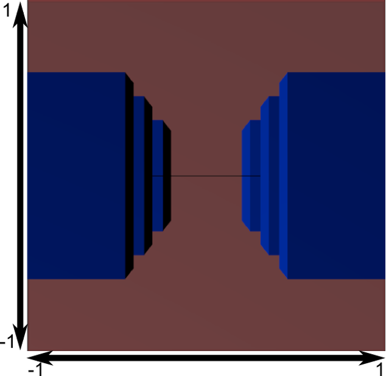
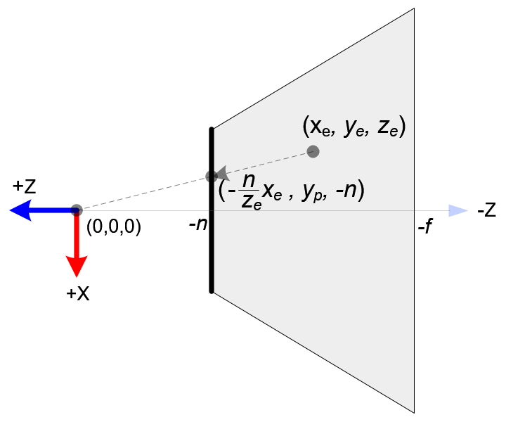
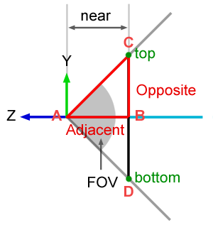

# 遊戲開發數學
## 電腦圖學 - 空間轉換 - Projection Matrix

Projection Matrix 是將頂點座標從 Camera Space 轉換至 Clip Space 的 4×4 轉換矩陣。它透過定義相機的「可視範圍」（View Frustum），決定哪些物件應該被繪製，同時也為後續的透視效果與深度計算提供必要的資訊。


Projection Matrix 的工作：如果 View Matrix 是「把相機擺好位置」，Projection Matrix 就是「調整鏡頭焦距與取景範圍」。

1. **定義可視範圍**：透過 Near/Far Plane、Field of View 等參數界定 View Frustum (視錐體)，只有在此範圍內的物件才會被繪製。
2. **映射到標準化空間**：將 View Frustum 內的座標壓縮映射到一個標準化空間 NDC (Normalized Device Coordinates)，供 GPU (Graphics Pipeline) 統一處理。
3. **編碼深度資訊**：將座標 $z$ 值映射到 $[0, 1]$ 或 $[-1, 1]$ 的範圍，寫入 Depth Buffer (深度緩衝區) 用於遮擋判斷。
4. **透視效果**：透視投影 (Perspective Projection) 達成近大遠小效果。

## Clip Space 與 NDC 與透視除法

先認識 2 個關鍵的空間：**Clip Space (裁剪空間)** 與 **Normalized Device Coordinates (NDC，標準化設備空間座標)**。

相機捕捉到的範圍稱為**視錐體 Frustum**，我們要把這個 Frustum 裡的所有東西包裝進一個 $[-1, 1]$ 的「標準正方體」中，接下來方便 GPU 把畫面畫到 2D 螢幕上。轉換會經過 2 個階段：

1. **Clip Space**：投影矩陣透過**不等比例縮放**，將實體的長方形視錐體，壓縮成邊界為 $\pm w$ 的「對稱角錐」。此時 GPU 會拿頂點**各自的 $w$** 進行 **Clipping (裁剪)**，切除超出 $[-w, w]$ 範圍的部分。
2. **NDC**：裁剪後，GPU 自動執行**透視除法 (Perspective Division)**，將 $x, y, z$ 除以 $w$。這步是透視的本體，將角錐強制壓成 $[-1, 1]$ 的完美正立方體，真正產生「近大遠小」的效果。

```math
\begin{aligned}
\begin{bmatrix} x_{ndc} \\ y_{ndc} \\ z_{ndc} \end{bmatrix}
&= \begin{bmatrix} x_c / w_c \\ y_c / w_c \\ z_c / w_c \end{bmatrix}
\end{aligned}
```

## 透視投影 (Perspective Projection)


接下來講解透視投影的 **Projection Matrix**。透視投影模擬人類的視覺，呈現「近大遠小」的空間感。投影矩陣的職責，就是將視錐體 (Frustum) 內的 3D 座標，轉換為 GPU 可以統一處理的標準空間。以下用 4 個核心觀念來理解這個過程（完整數學推導請見文末附錄）。

### 觀念 1：近大遠小 — 座標除以深度




相機放在原點，朝 $-Z$ 軸方向看過去。空間中的每個點，都會被「投影」到近平面（Near Plane）這塊底片上。透過相似三角形，可以得到投影後的座標：

$$x_p = \frac{n \cdot x_e}{-z_e}, \quad y_p = \frac{n \cdot y_e}{-z_e}$$



**重點：所有座標都除以了深度距離 $(-z_e)$。** 物體離相機越遠，$-z_e$ 越大，算出來的座標就越小——這就是「近大遠小」的本質。

### 觀念 2：映射到 NDC

投影後的座標範圍取決於視錐體的大小（由左 $l$、右 $r$、上 $t$、下 $b$ 邊界決定）。但 GPU 需要統一的標準範圍，所以我們透過線性映射，將這些座標壓縮進 NDC 的 $[-1, 1]$ 中。例如 X 軸：把 $[l, r]$ 映射到 $[-1, 1]$，就是一個單純的「縮放 + 平移」。

### 觀念 3：W 分量與透視除法

需要 4×4 矩陣一次完成整個投影運算。但觀念 1 告訴我們，座標最終都要「除以深度 $-z_e$」——而矩陣乘法只能做**加法和乘法**，沒辦法做「除以一個會變動的值」。

- 解法：把 $-z_e$ 先存進座標的第 4 個分量 $w_c$，之後再讓 GPU 硬體自動執行**透視除法 (Perspective Division)**，把所有座標除以 $w_c$。
- 具體做法是把投影矩陣的最後一排設成 `[0, 0, -1, 0]`，這樣矩陣乘法算出來的 $w_c$ 就會剛好等於 $-z_e$：

$$w_c = 0 \cdot x_e + 0 \cdot y_e + (-1) \cdot z_e + 0 \cdot w_e = -z_e$$

當 GPU 之後執行 $x_c / w_c$ 時，就自然完成了「除以深度」的效果。

### 觀念 4：非線性深度值

X、Y 解決了，深度 Z 值決定了物體的**前後遮擋關係**（深度測試），需要從 $[-n, -f]$ 映射到 $[-1, 1]$。但因為 Z 也經過了透視除法（除以 $-z_e$），最終的 Z 分佈變成一個**非線性的反比例函數**：
- **靠近相機的區域佔用了絕大部分的深度精度**
- **遠處精度極低**，即使距離差很大，算出來的 $z_{ndc}$ 也幾乎一樣
- 造就 **Z-Fighting（遠處物體閃爍交疊）**

### Perspective Projection Matrix

(OpenGL 右手座標系)矩陣：

```math
\begin{aligned}
P_{persp} &= \begin{bmatrix}
\dfrac{2n}{r - l} & 0 & \dfrac{r + l}{r - l} & 0 \\[6pt]
0 & \dfrac{2n}{t - b} & \dfrac{t + b}{t - b} & 0 \\[6pt]
0 & 0 & -\dfrac{f + n}{f - n} & -\dfrac{2fn}{f - n} \\[6pt]
0 & 0 & -1 & 0
\end{bmatrix}
\end{aligned}
```

矩陣中的 6 個參數對應視錐體的邊界：

| 參數 | 意義 |
|------|------|
| $n$ (near) | 近平面距離：相機能看到的最近距離 |
| $f$ (far) | 遠平面距離：相機能看到的最遠距離 |
| $l, r$ (left, right) | 近平面上的左右邊界 |
| $t, b$ (top, bottom) | 近平面上的上下邊界 |

一般開發情境投影範圍會是對稱的，即 $l = -r, t = -b$。這時 $r+l=0$ 且 $t+b=0$，矩陣可簡化為：

```math
\begin{aligned}
P_{persp} &= \begin{bmatrix}
\dfrac{n}{r} & 0 & 0 & 0 \\[6pt]
0 & \dfrac{n}{t} & 0 & 0 \\[6pt]
0 & 0 & -\dfrac{f + n}{f - n} & -\dfrac{2fn}{f - n} \\[6pt]
0 & 0 & -1 & 0
\end{bmatrix}
\end{aligned}
```

> **詳細數學推導請參閱[透視投影矩陣](https://hackmd.io/@23657689/projection_matrix)**。

### Field of View (FOV)

**實務應用：使用 FOV 取代邊界長度**



3D 引擎通常使用 **Field of View** (FOV，垂直視角， $\theta$ ) 和 **Aspect Ratio** (螢幕長寬比， $a$ ) 來設定 (Frustum) 投影範圍：

- **FOV 較大（廣角鏡頭）**：能看到的範圍越廣，但物體看起來較小，邊緣容易有透視變形。
- **FOV 較小（望遠鏡頭）**：能看到的範圍越窄，畫面有局部放大的感覺。

透過三角函數 $t = n \cdot \tan(\frac{\theta}{2})$ 與 $r = a \cdot t$ 進行代換，可將剛才的對稱矩陣轉換為最終的實務型態：

```math
\begin{bmatrix}
\dfrac{1}{a \cdot \tan(\theta/2)} & 0 & 0 & 0 \\[6pt]
0 & \dfrac{1}{\tan(\theta/2)} & 0 & 0 \\[6pt]
0 & 0 & -\dfrac{f + n}{f - n} & -\dfrac{2fn}{f - n} \\[6pt]
0 & 0 & -1 & 0
\end{bmatrix}
```

---

## 正交投影 (Orthographic Projection)


正交(平行)投影沒有「近大遠小」的效果，光線全部平行。故正交投影的視錐體本身就是長方體。只需要做 2 件事：
1. **位移**：把長方體中心移到原點。
2. **縮放**：把長方體壓扁成 $[-1, 1]$ 的標準正方體。

因為沒有透視除法，所以 $w$ 分量不需要變動，保持為 $1$。矩陣最後一排是 `[0, 0, 0, 1]`。

單純的線性映射解出的矩陣如下：

```math
\begin{aligned}
P_{ortho} &= \begin{bmatrix}
\dfrac{2}{r - l} & 0 & 0 & -\dfrac{r + l}{r - l} \\[6pt]
0 & \dfrac{2}{t - b} & 0 & -\dfrac{t + b}{t - b} \\[6pt]
0 & 0 & \dfrac{-2}{f - n} & -\dfrac{f + n}{f - n} \\[6pt]
0 & 0 & 0 & 1
\end{bmatrix}
\end{aligned}
```

$Z$ 軸一樣是單純將 $[-n, -f]$ 線性映射到 $[-1, 1]$。而對稱投影矩陣（即 $l = -r, t = -b$）可簡化為：

```math
\begin{aligned}
P_{ortho} &= \begin{bmatrix}
\dfrac{1}{r} & 0 & 0 & 0 \\[6pt]
0 & \dfrac{1}{t} & 0 & 0 \\[6pt]
0 & 0 & \dfrac{-2}{f - n} & -\dfrac{f + n}{f - n} \\[6pt]
0 & 0 & 0 & 1
\end{bmatrix}
\end{aligned}
```

---

## 效能與開發注意事項

基於以上的數學推導，我們在實際開發時應該注意：

1. **Near Plane 絕對不要設太小**：$0.1$ 比 $0.001$ 好非常多！因為 Z 值的非線性分佈，設得太小會直接吃掉遠處物體的深度精度，導致嚴重的 Z-Fighting。
2. **盡量縮小 Near 與 Far 的距離**：不需要畫的東西就讓 Far Plane 把它裁剪掉，這不僅能提高 Z 精度，還能減輕 GPU 負擔。
3. **透視除法是免費的**：GPU 在硬體層面 (Fixed-Function) 就會自動幫你做除以 $w$ 的動作，這比在 Shader 裡面自己用程式寫除法快多了。
4. **不要在 CPU 每一幀重算投影矩陣**：投影矩陣通常只依賴 FOV（視角大小）和 Aspect Ratio（螢幕長寬比）。除非玩家調整視窗大小或是相機焦距（例如開鏡狙擊），否則這個矩陣算好一次快取起來就好。

---

# 參考延伸閱讀

[OpenGL Projection Matrix - Song Ho](http://www.songho.ca/opengl/gl_projectionmatrix.html)

[Learn OpenGL - Coordinate Systems](https://learnopengl.com/Getting-started/Coordinate-Systems)

[透視投影矩陣 - HackMD](https://hackmd.io/@23657689/projection_matrix)