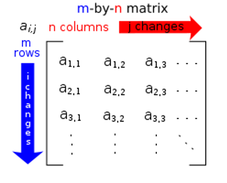
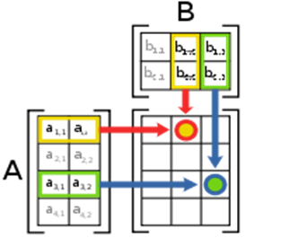

# 遊戲開發數學
## 電腦圖學 - 線性代數
電腦圖學 (Commputer Graphics)：電腦圖形繪圖技術。圖學核心數學：線性代數 (Linear Algebra)。

## 矩陣 - Matrix4x4
參考 wiki：http://en.wikipedia.org/wiki/Matrix_(mathematics)

矩陣通常以 m-by-n Matrix 或 Matrix(m, n) 來表示，其中 m 為行數 (row)、n 為列數 (column)。


電腦圖學技術中最常處理到的矩陣資料是 4x4 matrix 或 4x1 matrix。
```math
$$\begin{bmatrix}
a_{11} & a_{12} & a_{13} & a_{14} \\
a_{21} & a_{22} & a_{23} & a_{24} \\
a_{31} & a_{32} & a_{33} & a_{34} \\
a_{41} & a_{42} & a_{43} & a_{44}
\end{bmatrix}
,
\begin{bmatrix}
a_{11} \\
a_{21} \\
a_{31} \\
a_{41}
\end{bmatrix}$$
```

### 以下示範矩陣的運算
```math
$$a_{4x4} + b_{4x4} =
\begin{bmatrix}
a_{11} & a_{12} & a_{13} & a_{14} \\
a_{21} & a_{22} & a_{23} & a_{24} \\
a_{31} & a_{32} & a_{33} & a_{34} \\
a_{41} & a_{42} & a_{43} & a_{44}
\end{bmatrix}
+
\begin{bmatrix}
b_{11} & b_{12} & b_{13} & b_{14} \\
b_{21} & b_{22} & b_{23} & b_{24} \\
b_{31} & b_{32} & b_{33} & b_{34} \\
b_{41} & b_{42} & b_{43} & b_{44}
\end{bmatrix}
=
\begin{bmatrix}
a_{11} + b_{11} & a_{12} + b_{12} & a_{13} + b_{13} & a_{14} + b_{14} \\
a_{21} + b_{21} & a_{22} + b_{22} & a_{23} + b_{23} & a_{24} + b_{24} \\
a_{31} + b_{31} & a_{32} + b_{32} & a_{33} + b_{33} & a_{34} + b_{34} \\
a_{41} + b_{41} & a_{42} + b_{42} & a_{43} + b_{43} & a_{44} + b_{44}
\end{bmatrix}
$$
```
```math
$$a_{4x4} * scale = 
\begin{bmatrix}
a_{11} & a_{12} & a_{13} & a_{14} \\
a_{21} & a_{22} & a_{23} & a_{24} \\
a_{31} & a_{32} & a_{33} & a_{34} \\
a_{41} & a_{42} & a_{43} & a_{44}
\end{bmatrix}
\cdot s
=
\begin{bmatrix}
s \cdot a_{11} & s \cdot a_{12} & s \cdot a_{13} & s \cdot a_{14} \\
s \cdot a_{21} & s \cdot a_{22} & s \cdot a_{23} & s \cdot a_{24} \\
s \cdot a_{31} & s \cdot a_{32} & s \cdot a_{33} & s \cdot a_{34} \\
s \cdot a_{41} & s \cdot a_{42} & s \cdot a_{43} & s \cdot a_{44}
\end{bmatrix}
$$
```

矩陣相乘 A * B
```math
$$
(A * B)_{i,j} = \sum_{r=1}^{n} A_{i,r} \cdot B_{r,j}
$$
```


```math
$$a_{4x4}  X  b_{4x4} =
\begin{bmatrix}
a_{11} & a_{12} & a_{13} & a_{14} \\
a_{21} & a_{22} & a_{23} & a_{24} \\
a_{31} & a_{32} & a_{33} & a_{34} \\
a_{41} & a_{42} & a_{43} & a_{44}
\end{bmatrix}
\cdot
\begin{bmatrix}
b_{11} & b_{12} & b_{13} & b_{14} \\
b_{21} & b_{22} & b_{23} & b_{24} \\
b_{31} & b_{32} & b_{33} & b_{34} \\
b_{41} & b_{42} & b_{43} & b_{44}
\end{bmatrix}
=
\begin{bmatrix}
\sum_{r=1}^{4} a_{1r} b_{r1} & \sum_{r=1}^{4} a_{1r} b_{r2} & \sum_{r=1}^{4} a_{1r} b_{r3} & \sum_{r=1}^{4} a_{1r} b_{r4} \\
\sum_{r=1}^{4} a_{2r} b_{r1} & \sum_{r=1}^{4} a_{2r} b_{r2} & \sum_{r=1}^{4} a_{2r} b_{r3} & \sum_{r=1}^{4} a_{2r} b_{r4} \\
\sum_{r=1}^{4} a_{3r} b_{r1} & \sum_{r=1}^{4} a_{3r} b_{r2} & \sum_{r=1}^{4} a_{3r} b_{r3} & \sum_{r=1}^{4} a_{3r} b_{r4} \\
\sum_{r=1}^{4} a_{4r} b_{r1} & \sum_{r=1}^{4} a_{4r} b_{r2} & \sum_{r=1}^{4} a_{4r} b_{r3} & \sum_{r=1}^{4} a_{4r} b_{r4}
\end{bmatrix}
$$
```

轉置矩陣 Transpose
```math
$$
\begin{bmatrix}
a_{11} & a_{12} & a_{13} & a_{14} \\
a_{21} & a_{22} & a_{23} & a_{24} \\
a_{31} & a_{32} & a_{33} & a_{34} \\
a_{41} & a_{42} & a_{43} & a_{44}
\end{bmatrix}^T
=
\begin{bmatrix}
a_{11} & a_{21} & a_{31} & a_{41} \\
a_{12} & a_{22} & a_{32} & a_{42} \\
a_{13} & a_{23} & a_{33} & a_{43} \\
a_{14} & a_{24} & a_{34} & a_{44}
\end{bmatrix}
$$
```
