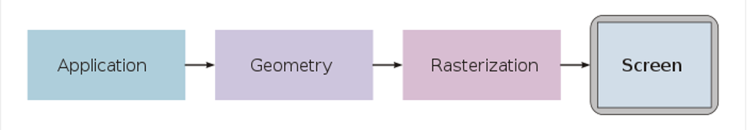
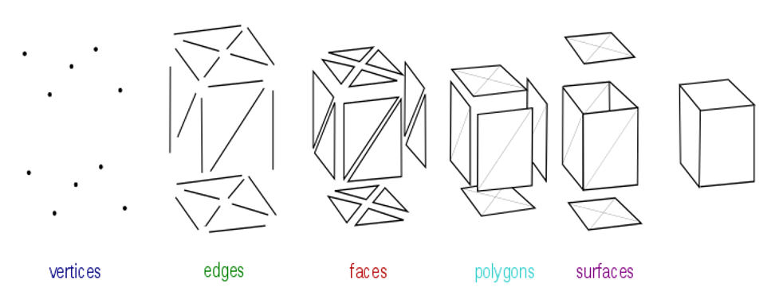

# 遊戲開發 - 渲染繪圖
## 電腦圖學
開發電腦軟體技術將指定 3D 世界內容會製成 2D 圖像。

### 渲染繪圖 Rendering

輸入：3D 幾何模型 (Mesh)。輸出結果 2D 圖像 (Image)。將 3D 內容投影到目標 2D 成像範圍內。

* Mesh

空間中單一個座標位置代表 1 個點 (Point)，2 個點形成一段線斷 (Line Segment)，3 個點形成三角形 (Triangle)，三角形即描述幾何外形形狀的最基本單位。

* Cartesian Coordinate System

一個點座標包含 X、Y、Z 軸分量，常以 4 個分量的向量表示: [X, Y, Z, W]，以利 4x4 Matrix 的矩陣運算，其中 W=0 代表方向，W=1 代表位置。Cartesian 座標系統有分左手定則與右手定則。

* 3D 場景 (Scene Graph)

把要繪圖的目標資料準備成為 3D (場景)世界內容。遊戲引擎常為此設計場景編輯工具，方便安排場景中的物件。3D 世界有固定的世界原點與 X、Y、Z 軸，每個物件有自己的定位座標位置，而該物件所含的幾何資料定義所有的頂點座標位置。

* 3D 投影成 2D

義好相機 (Camera)，以真實相機拍攝內容儲存至底片為原理，將 3D 幾何資料投影成為 2D 幾何內容。