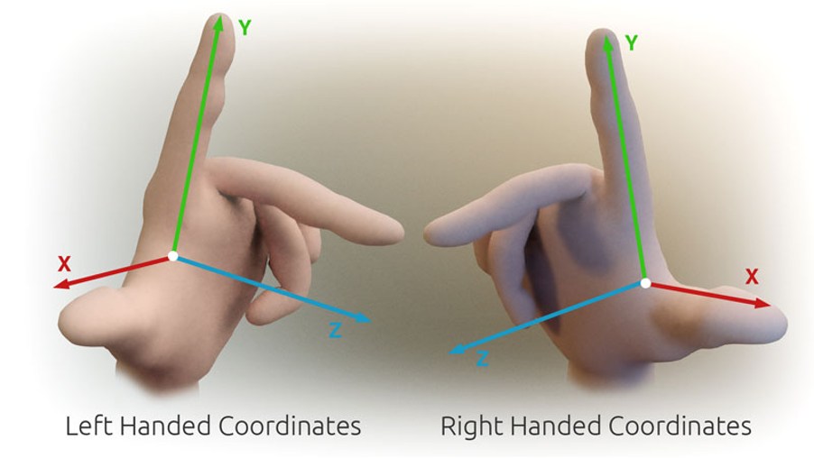

# 遊戲開發 - 渲染繪圖
## 電腦圖學
開發電腦軟體技術將指定 3D 世界內容會製成 2D 圖像。

### 渲染繪圖 Rendering

輸入：3D 幾何模型 (Mesh)。輸出結果 2D 圖像 (Image)。將 3D 內容投影到目標 2D 成像範圍內。

* Mesh

空間中單一個座標位置代表 1 個點 (Point)，2 個點形成一段線斷 (Line Segment)，3 個點形成三角形 (Triangle)，三角形即描述幾何外形形狀的最基本單位。模型資料 (Mesh) 定義含有多個三角形來組成(逼近)該幾何外形。

* Cartesian Coordinate System

一個點座標包含 X、Y、Z 軸分量，常以 4 個分量的向量表示: [X, Y, Z, W]，以利 4x4 Matrix 的矩陣運算，其中 W=0 代表方向，W=1 代表位置。Cartesian 座標系統有分左手定則與右手定則。

* 3D 場景 (Scene Graph)

把繪圖目標準備成為 3D (場景)世界內容。遊戲引擎常為此設計場景編輯工具，方便安排場景中的物件。3D 世界有固定的世界原點與 X、Y、Z 軸，每個物件有自己的定位座標位置，而該物件所含的幾何資料定義其所有頂點座標位置。

* 3D 投影成 2D

定義好相機 (Camera)，以真實相機拍攝儲存至底片的技術為原理，將 3D 幾何資料投影成為 2D 幾何內容。

### 3D Viewing

繪圖流程中 3D 視圖到 2D 投影成像的過程可描述為幾個重要步驟，並牽涉到座標空間轉換：
1. Model & Camera transformation: 幾何物件 (Primitive)的轉換姿態與鏡頭設置的運算 (World Space)。
2. Lighting: 決定打光效果。
3. Projection: 將輸入資訊投影到對應的投影空間中 (Clip Space)。
4. Clipping: 由投影空間決定那些物件資訊不在投影範圍內，排除在繪圖工作外 (Culling)。
5. Viewport transformation: 螢幕輸出裝置的繪圖區轉換運算 (Screen Space)。

繪圖流程中，繪圖目標(模型頂點)資料進行空間座標轉換計算的詳細過程：

1. Object Space: 物件幾何設計座標空間
2. World Space: 場景世界座標空間
3. Eye/Camera Space: 鏡頭座標空間
4. Clip Space: 正規投影座標空間
5. Device/Screen Space: 螢幕輸出裝置座標空間

* 鏡頭空間轉換 Viewing Transformation

* 正規投影空間轉換 Projection Transformation

### Rendering Pipeline

# 參考延伸閱讀

[電腦圖學 - 00: OpenGL](https://medium.com/maochinn/%E9%9B%BB%E8%85%A6%E5%9C%96%E5%AD%B800-opengl-fa7105f59ecd)

[電腦圖學繪圖流程](https://www.slideshare.net/slideshow/20170621-77540223/77540223)
