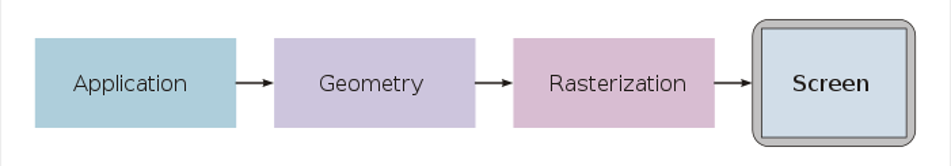
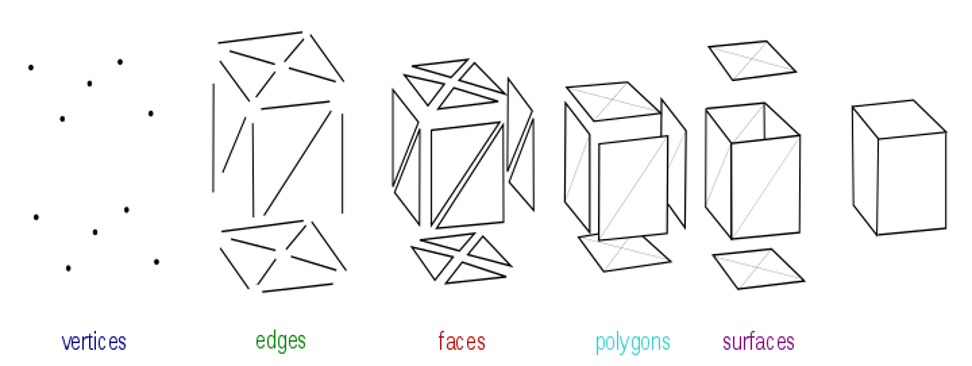
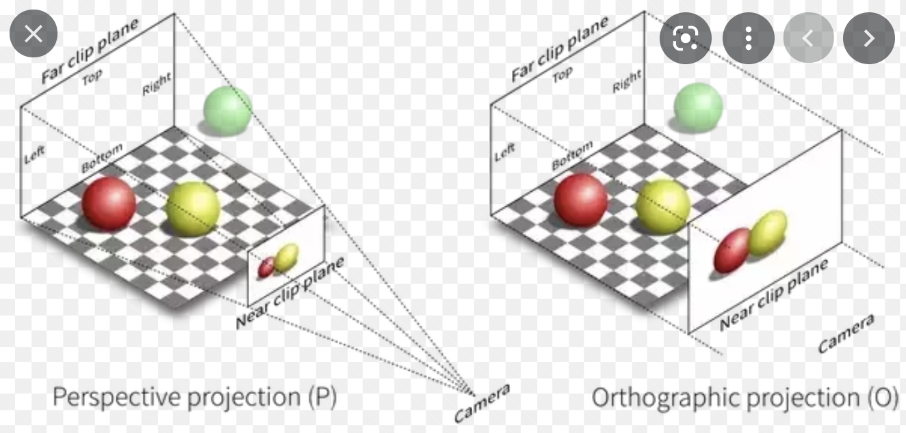
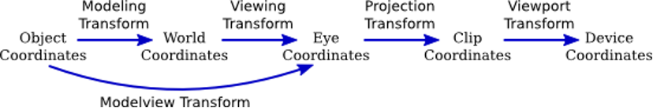
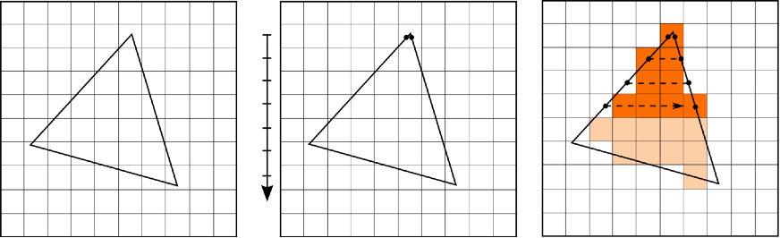

# 遊戲開發 - 電腦圖學 Computer Graphics
開發電腦軟體技術將指定 3D 世界內容會製成 2D 圖像。

## 繪圖渲染 Rendering

輸入：3D 幾何模型 (Mesh)。輸出結果 2D 圖像 (Image)。將 3D 內容投影到目標 2D 成像範圍內。

* 模型 Mesh

空間中單一個座標位置代表 1 個點 (Point)，2 個點形成一段線斷 (Line Segment)，3 個點形成三角形 (Triangle)，三角形即描述幾何外形形狀的最基本單位。模型資料 (Mesh) 定義含有多個三角形來組成(逼近)該幾何外形。

* Cartesian Coordinate System

一個點座標包含 X、Y、Z 軸分量，常以 4 個分量的向量表示: [x, y, z, w]，以利 4x4 Matrix 的矩陣運算，其中 W=0 代表方向，W=1 代表位置。Cartesian 座標系統有分左手定則與右手定則。

* 3D 場景 (Scene Graph)

把繪圖目標準備成為 3D (場景)世界內容。遊戲引擎常為此設計場景編輯工具，方便安排場景中的物件。3D 世界有固定的世界原點與 X、Y、Z 軸，每個物件有自己的定位座標位置，而該物件所含的幾何資料定義其所有頂點座標位置。

* 3D 投影成 2D

定義好相機 (Camera)，以真實相機拍攝儲存至底片的技術為原理，將 3D 幾何資料投影成為 2D 幾何內容。

### 3D Viewing

繪圖流程中 3D 視圖到 2D 投影成像的過程可描述為幾個重要步驟，並牽涉到座標空間轉換：
1. Model & Camera transformation: 幾何物件 (Primitive) 的轉換姿態與相機設置的運算 (World Space)。
2. Lighting: 決定打光效果。
3. Projection: 將輸入資訊投影到對應的投影空間中 (Clip Space)。
4. Clipping: 由投影空間決定那些物件資訊不在投影範圍內，排除在繪圖工作外 (Culling)。
5. Viewport transformation: 螢幕輸出裝置的繪圖區轉換運算 (Screen Space)。

為了將 3D 空間幾何投影成為 2D 結果，過程是對模型資料(頂點)座標資訊進行座標空間的轉換計算 (每個空間轉換過程各自依賴對應的轉換矩陣 4x4 Matrix)，目的是為了計算出最終在(螢幕)畫面結果上的投影座標位置，下圖描述完整的座標空間轉換過程：

1. Object Space: 物件幾何設計座標空間

Modeling Transformation: 建模轉換，Model Matrix 將 Object Space 座標轉換到 World Space。

2. World Space: 場景世界座標空間

Viewing Transformation: 相機空間轉換，View Matrix 將 World Space 座標轉換到 Camera Space。

3. Eye/Camera Space: 相機座標空間

相機座標空間：以相機位置為空間原點，相機本身的視角定義其空間的 X、Y、Z 軸，Z軸與視角方向平行。

Projection Transformation: 投影空間轉換，Projection Matrix 將 Camera Space 座標轉換到 Clip/Canonical Space。

4. Clip Space: 正規投影座標空間

正規投影空間是一個最小到最大範圍為 [-1, -1, -1] ~ [1, 1, 1] 的正立方體空間，故座標位置落在此正立方體外的，即這次繪圖中看不到的內容，可以被排除 (Clipping)。Viewport Transformation: 2D 目標視圖空間轉換，將 Clip Space 座標轉換(計算)成為 Screen Space 座標。

5. Device/Screen Space: 螢幕輸出裝置座標空間

### Projection Transformation
相機設置決定一個 3D 可視範圍，稱作 View Volume/View Frustum (視錐)。

投影的目標即將可視範圍內的內容投影到 Near 距離的平面 (Near Clipping Plane) 2D 可視區域內。投影分成透視投影 (Perspective) 與平行投影 (Orthogonal/Parallel)。

* Orthogonal Projection

* Perspective Projection

而透視投影過程可觀測到會讓目標物件進行依照距離遠近而壓縮投影大小結果，產生真實世界中遠景越來越小的透視效應。

投影最終目標是將 Camera Space 轉換到 Clip Space，讓後續計算出正確的目標裝置上的螢幕座標，完成指定像素 (Pixel) 上色。

### 光柵化 Rasterization

繪圖流程完成投影後，最後階段是對目標像素 (Pixel) 完成上色結果 (Pixel Color: [red, green, blue, alpha])，此階段稱作 Rasterization。下列介紹電腦圖學裡提出的主流演算法。

[Scanline-Fill](https://www.cs.uic.edu/~jbell/CourseNotes/ComputerGraphics/PolygonFilling.html)

[Triangle-Fill](https://www.sunshine2k.de/coding/java/TriangleRasterization/TriangleRasterization.html) & [Edge-Function-Rasterizer](https://www.scratchapixel.com/lessons/3d-basic-rendering/rasterization-practical-implementation/rasterization-stage.html)

目前 GPU (Graphics Processor Unit) 主流實現的是 Edge-Function-Rasterizer 演算法，三角形的輸入資料從 3 個頂點資料帶入，而三角形涵蓋到的每個像素 (Pixel) 輸入資料則是透過從頂點資料做線性內插計算得來，依此方法來決定(計算)結果顏色 (Color: [r, g, b, a])。

# 參考延伸閱讀

[Your Starting Point!](https://www.scratchapixel.com/lessons/3d-basic-rendering/get-started/gentle-introduction-to-computer-graphics-programming.html)

[opengl-tutorial: Tutorial 3: Matrices](https://www.opengl-tutorial.org/beginners-tutorials/tutorial-3-matrices/)

[電腦圖學 - 00: OpenGL](https://medium.com/maochinn/%E9%9B%BB%E8%85%A6%E5%9C%96%E5%AD%B800-opengl-fa7105f59ecd)

[電腦圖學繪圖流程](https://www.slideshare.net/slideshow/20170621-77540223/77540223)

[Rasterization](https://www.scratchapixel.com/lessons/3d-basic-rendering/rasterization-practical-implementation/overview-rasterization-algorithm.html)