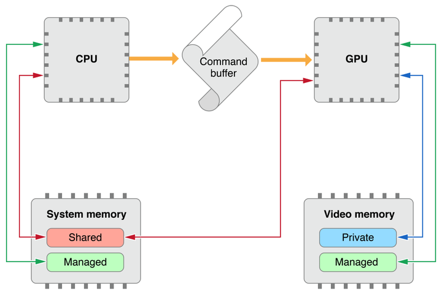
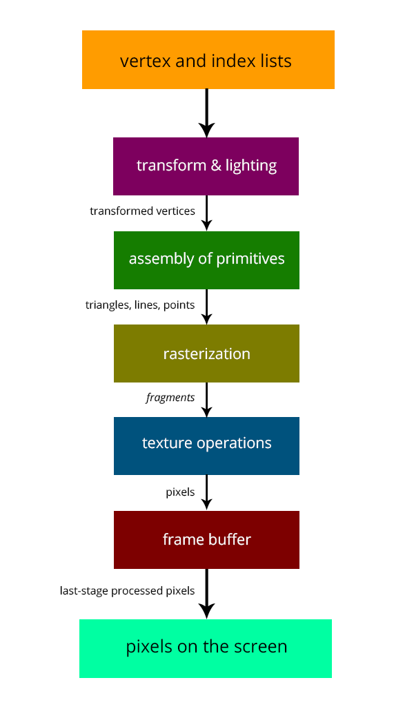
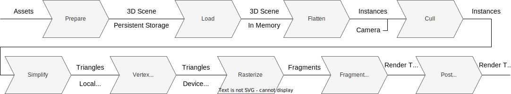
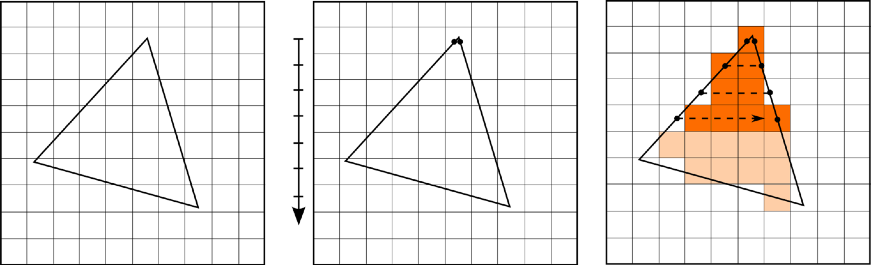
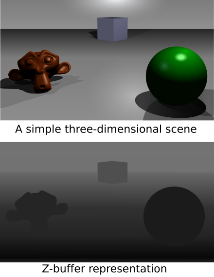
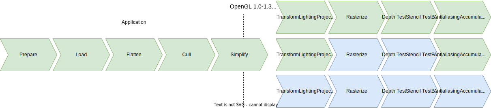

# 遊戲開發 - GPU繪圖管線

GPU: Graphics Processing Unit

繪圖管線 (Rendering Pipeline | Graphics Pipeline) 意指 3D 場景內容轉換成為 2D 影像結果的運作流程。可概略分為以下 5 階段：

1. **應用階段 (Application)**
2. **幾何處理 (Geometry Processing)**
3. **光柵化 (Rasterization)**
4. **片段著色 (Fragment Shading)**
5. **輸出合成 (Output Merging)**

如果從畫面結果反推 GPU 繪圖管線的運作流程：

- 最終階段是**輸出合成 (Output Merging)**，將所有處理完成的片段資訊整合並寫入 Framebuffer，產生最終的 2D 畫面。
- 在此之前的**片段著色 (Fragment Shading)** 階段，GPU 會為每個片段計算顏色與深度值，並透過一系列深度測試和混合運算，決定最終的像素呈現。
- 更前面在**光柵化 (Rasterization)** 階段，GPU 會將 2D 投影後的圖元分解成大量的片段 (Fragment)。片段是一個包含位置、顏色、深度等資訊的資料結構，每個片段都對應到螢幕上的一個像素位置。這些片段會被送往下一個階段進行著色處理。
- 在光柵化之前，**幾何處理 (Geometry Processing)** 階段負責將 3D 物件的頂點進行座標轉換，包含鏡頭空間轉換、投影轉換等運算，同時也處理光照計算。
- 整個流程的起點是 **應用階段 (Application)**，由 CPU 負責準備場景資料、處理遊戲邏輯，並發送繪圖指令給 GPU 開始渲染流程。

為了電腦繪圖的目標，不同的出發點 (OpenGL | Vulkan | Direct3D | Metal | Game Engine | GPU ...) 有各自的角度闡述 Rendering Pipeline，此文章專注於傳統 GPU 架構運作概念。

## 繪圖管線概念

之前文章已介紹繪圖所需完成的工作流程，早期 GPU 搭配電腦圖學函式庫 (Graphics API) 實現一套固定繪圖管線 (Fixed Function Rendering Pipeline)，運作過程 GPU 執行固定不變的繪圖工作，圖學函式庫可有限制地控制 GPU 工作狀態。下方示意圖中，軟體應用程式需要準備好繪圖資訊 (vertex and index lists)，指定頂點如何完成座標轉換並可實現頂點的光照運算 (transform & lighting)，然後將這些幾何單元資訊傳遞至 GPU 端 (assmbly of primitives)，GPU 進行 rasterization 工作，並支援存取指定貼圖 (texture operations) 計算出貼圖顏色，最終算出像素顏色結果寫入至目標畫面 (繪圖緩衝區，Frame Buffer)，最終 GPU 完成畫面更新。

這裡借用一篇好文章 ([A Trip Down The Graphics Pipeline](https://www.thecandidstartup.org/2023/03/13/trip-graphics-pipeline.html#:~:text=3D%20Graphics%20Pipeline))，使用其中的管線流程圖來更完整地講解繪圖管線工作流程。

### 事前準備 (Parepare, Load, Flatten)
繪圖內容通常可使用場景表達 (e.g. Hierarchical Scene Graph)，將指定場景內容以 GPU 認得的資料格式儲存進記憶體，比方說將繪圖對象物件包裝為一組含幾何模型 (Mesh Buffer)，材質描述 (Material)，與空間轉換(Transformation Matrix)資料。

### 繪圖剔除 (Cull)
此階段處理針對指定鏡頭，剔除可視範圍之外的所有物件，主要技術為 Frustum Culliing。

### 工作簡化優化 (Simplify)
此階段可進行依視角決定資料複雜度的優化處理，主要技術如 Level of Detail (較遠、較小的物件採取低複雜度資料輕量的內容傳送給 GPU 端進行繪圖工作)。

### 頂點運算 (Vertex Processing)
此階段 GPU 已經接收到繪圖對象的幾何單元資訊 (三角形 (Triangle) | 線段 (Line) | 點 (Point))，並且得到一組頂點輸入資料。每個頂點帶有座標位置資訊 (X, Y, Z)，並可帶有軟體程式指定的額外頂點屬性 (Vertex Attribute)，如顏色 (Color)、法向量 (Normal Vector)、貼圖指定坐標 (U, V) 等。GPU 負責將頂點計算投影至目標 2D 投影空間的像素座標位置，並且可指定進行光照運算 (Lighting)，還有針對螢幕可視範圍進行幾何裁切 (Clipping) 避免繪圖區域跑出螢幕可視區域外。運算完成時 GPU 將頂點運算結果儲存到指定的頂點屬性輸出暫存器 (Output Vertex Attributes)。

### 光柵化 (Rasterize)

之前文章已簡介過光柵化過程以及相關演算法。GPU 會將頂點運算階段輸出的屬性結果使用線性內差 (Linear Interpolation) 計算其涵蓋到的像素輸入資料。

### 像素片段運算 (Fragment Processing)
此階段 GPU 對每個像素 (Pixel) 計算顏色結果，過程中支援對貼圖資源存取完成貼圖顏色映射運算 (Texture Mapping)，並更新到繪圖目標畫面 (Render Target) 的指定像素。Render Target 是一段配置好的連續記憶體緩衝區，因此也稱為 Frame Buffer。此階段在更新目標像素時還會做深度測試檢查 (Depth/Z Test)，正常來說繪製不透明物件時，會將新的像素位置計算得到的深度 (距離鏡頭之深度) 與原本 Render Target 上的像素深度做比較，如果新的像素位置比較近才進行像素結果更新，代表新的像素可以被畫到目標畫面上，反之代表新的像素比較遠已經被原本的像素擋住。除了深度測試外也可以指定進行遮罩測試檢查 (Stencil Test)，運作原理相近。最終進行更新目標像素資料時，除了直接取代新顏色外，也可使用指定透明度進行透明顏色混合運算 (Alpha Blend)，達成透明物件繪圖功能。

此階段除了像素顏色 (Color) 運算，還要支援深度與遮罩測試，因此每個繪圖目標緩衝區 (Frame Buffer)，除了顏色緩衝區 (Color Buffer) 外都支援與其完全對映的深度緩衝區 (Depth & Stencil Buffer)。而 GPU 何時與如何進行深度/遮罩測試檢查，透明混合繪圖運算，都透過圖學函式庫指定改變 GPU 的工作狀態達成控制。

### 畫面後處理 (Post Processing)
2D 結果畫面已完成，此階段可進行畫面後處理如反鋸齒 (Anti-Aliasing)，Gamma校正，影像濾鏡處理等。

## Legacy Fixed Function Pipeline

同樣借用好文章介紹早期 ([1991-2000 Fixed Function Pipeline](https://www.thecandidstartup.org/2023/03/13/trip-graphics-pipeline.html#:~:text=1991%2D2000%20%3A%20The%20Fixed%20Function%20Pipeline)) 固定繪圖管線運作流程圖，圖中綠色區塊代表 CPU 端軟體層負責處理，藍色區塊代表 GPU 端硬體層完成。可看到頂點運算階段 (Vertex Processing) 列出該階段可進行處理工作 (Transform, Lighting, Projection, Clipping)；像素運算階段 (Fragment Processing) 亦列出處理工作 (Depth Test, Stencil Test, Blend, Texture Mapping)。

# 參考延伸閱讀

[A Trip Down The Graphics Pipeline](https://www.thecandidstartup.org/2023/03/13/trip-graphics-pipeline.html)

[Graphics Pipeline](https://medium.com/@rakadian/graphics-pipeline-9e4bb2d28f58)
