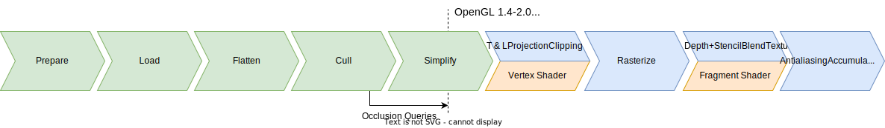
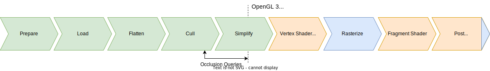
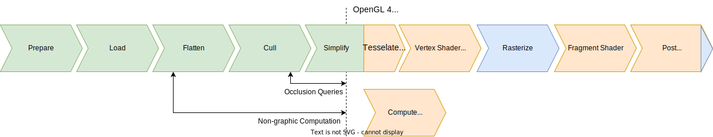
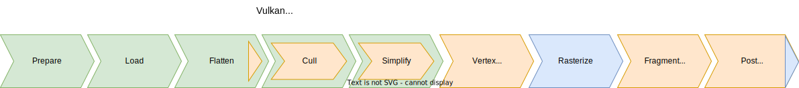
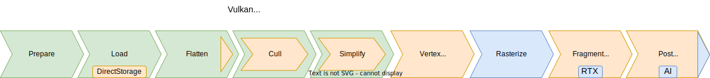
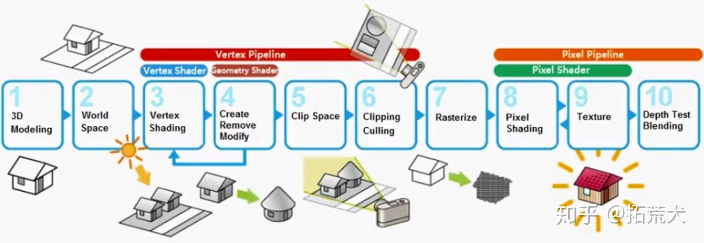
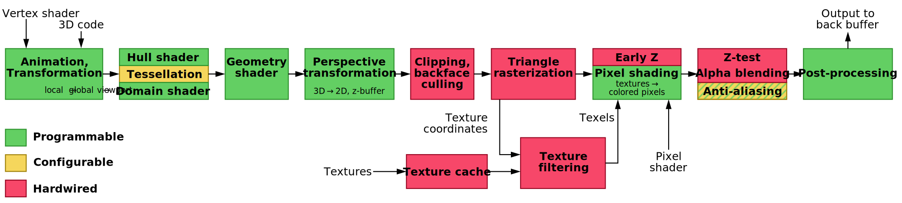
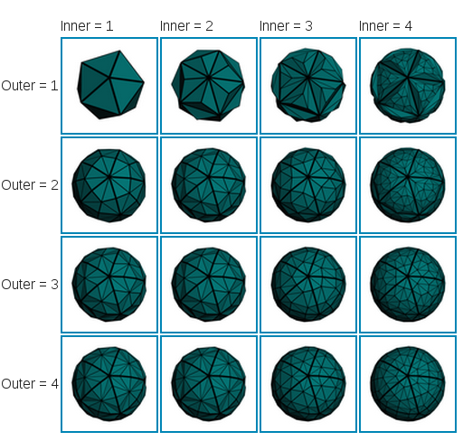

# 遊戲開發 - GPU Shader
前面介紹 Fixed Function Pipeline，GPU 依繪圖管線完成固定繪圖工作。但開發者需要更多彈性，因此寫給 GPU 執行的程式的概念被發明，也就是著色器 (Shader)。

## Programmable Pipeline

續文章 ([A Trip Down The Graphics Pipeline](https://www.thecandidstartup.org/2023/03/13/trip-graphics-pipeline.html)) 中介紹可程序化繪圖管線 (Graphics Programmable Pipeline)，Shader 即一起被發明提出。接下來簡介發展史。

### 2001 ~ 2005 主流 Programmable Vertex & Fragment Shader



Shader 突破了原本固定繪圖管線的硬體限制。這時期 GPU 有頂點 (Vertex Shader) 和像素片段 (Fragment Shader) 2 種專門處理單元。Graphics API，OpenGL 1.4 和 Direct3D 8 推出革命性的高階著色器語言 (High-Level Shader Language)，為 C 語言相似的語法，編譯後成為低階 Shader 組合語言程式集。

有 Shader 概念後，軟體技術推出了材質 (Material) 管理 (優化編譯 Shader 流程)，並設計渲染通道 (Rendering Pass) 繪圖流程來完成多種光照功能 (Lighting)。

### 2006 ~ 2010 主流 Unified Shader Model



GPU 演進推出統一的 Shader 架構執行單元，實現更高度平行優化地調度執行 Vertex 與 Fragment Shaders。

此時期推出幾何著色器 (Geometry Shader)。著名的延遲渲染 (Deferred Rendering) 技術被發明以實現複雜的(多光源)光照繪圖功能，成為主流的遊戲繪圖技術。

### 2011 ~ 2015 主流 tesselation & compute shader



這時期推出曲面細分著色器 (Tesselation Shader)。Graphics API 開始支持(有限的)多線程繪圖 (Multi-Threading Rendering)。然後是推出計算著色器 (Compute Shader)，擴展 GPU 上進行非圖形渲染之通用計算。

### 2016 ~ 2020 主流 (Vulkan | Direct3D 12 | Metal) for GPGPU



這時期推出全新架構的 Graphics API，Direct3D 12 和 Vulkan (下一世代的 OpenGL)。新 API 賦予開發者前所未有的硬體控制能力，但同時也增加了使用複雜度。開發者現在能直接操作 GPU 命令緩衝區、精確控制 CPU 與 GPU 間的內存同步，以及自主管理數據緩衝區格式。Compute Shader 可在 GPU 上直接生成渲染所需的輸入數據，實現 GPU-Driven Rendering。

### 2021 ~ (2024+) Specialized Hardware



GPU 硬體創新添加了 2 種新型專用單元：
1. **RTX 核心**：硬體加速光線追蹤 (Ray Tracing)。
2. **AI 核心**：執行預先訓練好的機器學習模型，用於後處理任務，如降噪 (適合 Ray Tracing)、抗鋸齒、上採樣、甚至生成中間幀 (Intermediate Frame) 以提升感知幀率 (Frames Per Second，FPS)。

另 [DirectStorage](https://github.com/microsoft/DirectStorage) 技術也允許數據直接高速從 SSD 加載到 GPU。

## Shader



上圖簡易示意繪圖管線的繪圖過程，下圖是更詳細的近代 Graphics Pipeline 架構流程圖。接著介紹重要 Shaders (Vertex | Tesselation | Geometry | Fragment | Compute)。



其中對初學者來說最重要的是 Vertex & Fragment Shaders，這裡預設以 OpenGL API 系列以及 GLSL 語法為前提做介紹。

### Vertex Shader

繪圖管線中首先執行的可程式化階段，主要負責處理每個頂點的位置和屬性變換，接收來自 GPU 端記憶體 (內存，Video Memory) 的頂點數據，通常由 CPU 預先上傳到 GPU 的頂點緩衝區(Vertex Buffer Objects)中。

**輸入 (Input)**:
- `attribute`：頂點數據，如位置 (`vec3 position`)、法線 (`vec3 normal`)、紋理座標 (`vec2 texCoord`) 等...
- `uniform`：由應用程式提供的全局變數，如變換矩陣 (`mat4 modelViewMatrix`, `mat4 projectionMatrix`)

**輸出 (Output)**:
- `varying`/`out`：傳遞給 Fragment Shader 的數據 (後續像素計算處理用)，如線性插值後的紋理座標、法線等。
- `gl_Position`：必須輸出的內建變數，表示頂點在裁剪空間 (Clip Space) 的座標。

```glsl
// 頂點屬性 (輸入)
attribute vec3 position;
attribute vec3 normal;
attribute vec2 texCoord;

// 全局變數 (輸入)
uniform mat4 modelViewMatrix;
uniform mat4 projectionMatrix;

// 傳遞給片段著色器的變數 (輸出)
varying vec2 vTexCoord;
varying vec3 vNormal;

void main() {
    // 計算裁剪空間的頂點位置
    gl_Position = projectionMatrix * modelViewMatrix * vec4(position, 1.0);
    
    // 傳遞插值數據給片段著色器
    vTexCoord = texCoord;
    vNormal = normal;
}
```

### Fragment Shader / Pixel Shader

處理經過光柵化階段 (Rasterization) 產生的每個片段 (Fragment of Pixels)，計算最終的像素顏色 (Color: red, green, blue, alpha) 輸出。片段對應於屏幕上的一個像素位置，但在現代 GPU 中通常以 2x2 像素區塊為單位並行處理。

**輸入 (Input)**:
- `varying`/`in`：從 Vertex Shader 線性插值傳來的數據。
- `uniform`：全局變數，如貼圖紋理採樣器 (`sampler2D texture`)、光照參數等...
- `gl_FragCoord`：內建變數，表示片段在(螢幕)窗口座標中的位置。

**輸出 (Output)**:
- `gl_FragColor`：片段的最終顏色 (較新 GLSL 中為 `out vec4 fragColor`)。

```glsl
// 從頂點著色器傳來的插值數據 (輸入)
varying vec2 vTexCoord;
varying vec3 vNormal;

// 全局變數 (輸入)
uniform sampler2D diffuseMap;
uniform vec3 lightDir;
uniform vec3 lightColor;

void main() {
    // 採樣紋理
    vec4 texColor = texture2D(diffuseMap, vTexCoord);
    
    // 簡單漫反射光照計算
    vec3 normal = normalize(vNormal);
    float diffuseFactor = max(dot(normal, lightDir), 0.0);
    vec3 diffuse = lightColor * diffuseFactor;
    
    // 最終輸出顏色
    gl_FragColor = texColor * vec4(diffuse, 1.0);
}
```

繪圖過程中 Vertex Shader 負責空間轉換和頂點處理，而 Fragment Shader 則處理材質、光照和最終的像素著色，共同完成一個幾何形狀 (Primitive，ex. Triangles) 之 GPU 渲染工作。

### Geometry Shader

介於 Vertex Shader 和 Fragment Shader 之間的可選階段，能夠產生或刪除幾何圖元（Primitive）。與 Vertex Shader 不同，Geometry Shader 可以處理整個圖元（如三角形、線段）並輸出新的幾何形狀。主要應用於：
- 動態調整模型細節
- 粒子系統生成
- 特殊視覺效果（如模型"爆炸"效果）
- 渲染到多個方向（如立方體貼圖生成）

```glsl
#version 330 core
layout(triangles) in;
layout(triangle_strip, max_vertices = 3) out;

in vec3 vNormal[];  // 頂點著色器傳來的數據
out vec3 gNormal;   // 傳給片段著色器的數據

uniform float explodeAmount;  // 爆炸效果的強度

void main() {
    // 計算三角形的中心法線方向
    vec3 faceNormal = normalize(cross(
        gl_in[1].gl_Position.xyz - gl_in[0].gl_Position.xyz,
        gl_in[2].gl_Position.xyz - gl_in[0].gl_Position.xyz
    ));
    
    // 沿法線方向移動三角形頂點
    for(int i = 0; i < 3; i++) {
        gl_Position = gl_in[i].gl_Position + vec4(faceNormal * explodeAmount, 0.0);
        gNormal = vNormal[i];
        EmitVertex();
    }
    EndPrimitive();  // 完成一個三角形的輸出
}
```

Geometry Shader 在現代遊戲開發中已不再是主流，主因為 GPU 架構上的性能效率低下、打破了 GPU 並行模式，且大部分功能可通過其他技術更高效實現。

### Tesselation Shader



允許在 GPU 上動態細分幾何圖元的專用階段，讓遊戲能夠根據需要增加模型細節，而無需預先建模高面數模型。由兩部分組成：

**Tessellation Control Shader**:
- 決定要如何細分每個圖元（如三角形或四邊形）
- 設置細分等級（可根據距離相機遠近動態調整）

**Tessellation Evaluation Shader**:
- 處理細分後新生成的頂點
- 計算這些新頂點的位置、法線和紋理座標等屬性

主要應用於：
- 細節層次控制 (LOD, Level of Detail)
- 地形渲染
- 水面模擬
- 角色模型近距離細節增強

```glsl
// Tessellation Control Shader 示例
#version 410 core
layout(vertices = 3) out;  // 輸出3個控制點 (三角形)

// 從頂點著色器接收的數據
in vec3 vPosition[];  // 頂點位置
in vec2 vTexCoord[];  // 紋理座標

// 傳遞給下一階段的數據
out vec3 tcPosition[];  // 控制點位置
out vec2 tcTexCoord[];  // 控制點紋理座標

uniform float tessLevel;  // 細分等級 (由CPU程式設定)

void main() {
    // 直接傳遞頂點數據給對應的控制點
    tcPosition[gl_InvocationID] = vPosition[gl_InvocationID];
    tcTexCoord[gl_InvocationID] = vTexCoord[gl_InvocationID];
    
    // 只在處理第一個控制點時設置細分等級 (避免重複設置)
    if (gl_InvocationID == 0) {
        // 設置外部和內部細分級別
        // 外部邊緣的細分
        gl_TessLevelOuter[0] = tessLevel;
        gl_TessLevelOuter[1] = tessLevel;
        gl_TessLevelOuter[2] = tessLevel;
        // 內部區域的細分
        gl_TessLevelInner[0] = tessLevel;
    }
}

// Tessellation Evaluation Shader 示例
#version 410 core
// 指定處理三角形、均勻細分、逆時針頂點順序
layout(triangles, equal_spacing, ccw) in;

// 從Tessellation Control Shader接收的數據
in vec3 tcPosition[];  // 控制點位置
in vec2 tcTexCoord[];  // 控制點紋理座標

// 輸出到下一階段
out vec3 tePosition;  // 新頂點位置
out vec2 teTexCoord;  // 新頂點紋理座標

// 變換矩陣
uniform mat4 modelViewMatrix;
uniform mat4 projectionMatrix;

void main() {
    // gl_TessCoord是重心座標，表示新頂點在三角形內的位置
    
    // 使用重心座標線性插值計算新頂點的位置
    vec3 position = gl_TessCoord.x * tcPosition[0] + 
                     gl_TessCoord.y * tcPosition[1] + 
                     gl_TessCoord.z * tcPosition[2];
    
    // 同樣插值計算紋理座標
    teTexCoord = gl_TessCoord.x * tcTexCoord[0] + 
                  gl_TessCoord.y * tcTexCoord[1] + 
                  gl_TessCoord.z * tcTexCoord[2];
    
    // 保存世界空間位置 (供下個階段使用)
    tePosition = position;
    
    // 計算裁剪空間座標 (必要輸出)
    gl_Position = projectionMatrix * modelViewMatrix * vec4(position, 1.0);
}
```

Tessellation 技術在特定場景（如地形渲染）仍有用途，但沒有廣泛普及成為主流，主要受限於實現複雜度高、可控性不足、計算成本高，以及傳統 LOD 模型與位移貼圖等替代技術已足夠應對大多數場景需求。

### Compute Shader

與傳統圖形管線獨立運行的通用計算著色器，不直接參與渲染過程，但能執行各種並行計算任務。其獨特之處在於能夠存取緩衝區和紋理，進行讀寫操作，實現圖形渲染以外的通用計算。

主要應用於：
- 物理模擬（粒子系統、布料、流體）
- 圖像處理（濾鏡效果、後處理）
- 生成程序化內容（如噪聲貼圖、地形）
- 人工智能計算（如尋路算法）
- 數據計算和預處理

```glsl
#version 430 core
// 定義工作組大小：每個工作組處理16x16個像素
layout(local_size_x = 16, local_size_y = 16) in;

// 輸入和輸出紋理 (這裡用來實現簡單的圖像亮度調整)
layout(rgba8, binding = 0) uniform readonly image2D inputImage;   // 只讀輸入圖像
layout(rgba8, binding = 1) uniform writeonly image2D outputImage; // 只寫輸出圖像

// 亮度調整因子
uniform float brightnessAdjust;

void main() {
    // 獲取當前執行的全局坐標 (對應紋理上的像素位置)
    ivec2 pixelCoord = ivec2(gl_GlobalInvocationID.xy);
    
    // 從輸入圖像讀取顏色值
    vec4 pixel = imageLoad(inputImage, pixelCoord);
    
    // 調整RGB通道的亮度 (保持Alpha不變)
    vec4 resultColor = vec4(pixel.rgb * brightnessAdjust, pixel.a);
    
    // 將處理後的顏色寫入輸出圖像
    imageStore(outputImage, pixelCoord, resultColor);
}
```

# 參考延伸閱讀

[A Trip Down The Graphics Pipeline](https://www.thecandidstartup.org/2023/03/13/trip-graphics-pipeline.html)

[Graphics Pipeline Wiki](https://en.wikipedia.org/wiki/Graphics_pipeline)