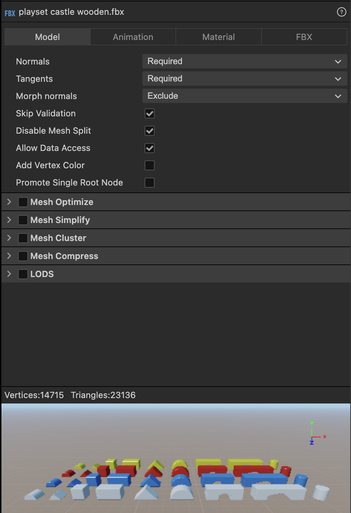
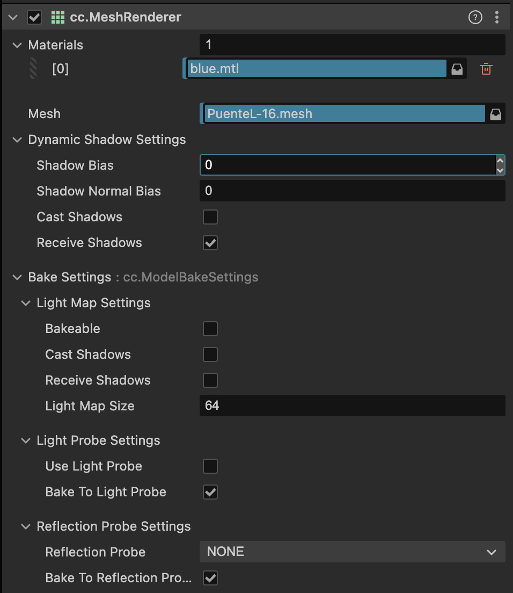

# 遊戲開發 - 模型 Mesh

模型 (Mesh) 是 3D 物體的幾何資料集合，透過 GPU 記憶體緩衝區 (GPU Buffer) 高效地將其頂點、索引等資訊傳送到顯示卡進行繪圖。GPU Rendering Pipeline 中最先執行之 Vertex Shader 的輸入資料即來自 Mesh 的頂點。

## 資料 Mesh Data

Mesh 由多邊形構成，通常以三角形集合來描述，Mesh Data 包含頂點資料(位置、屬性等)與索引資料(三角形組合)。

### 模型檔案

3D 建模軟體可以自由創建 3D Mesh，然後儲存成為模型檔案匯入給遊戲引擎軟體等使用。遊戲開發常用檔案格式有：

1. FBX
- 最廣泛：Autodesk 開發，遊戲引擎首選
- 功能完整：支援動畫、材質、骨骼、攝影機等

2. glTF/GLB
- 新標準：Khronos Group 推動的開放格式
- 效率高：針對實時渲染最佳化
- Web 友好

3. OBJ
- 最簡單：純文字格式，易於理解，但檔案容量也較大
- 輕量級：只包含幾何資料，不支援動畫
- 通用性強：容易支援所以普及

### Vertex

Mesh 構成的最基本資料為頂點 (Vertex)，代表空間中的點。3 個頂點構成 1 三角形，多個三角形構成 Mesh。頂點的必要定義即頂點位置，Computer Graphics 中以頂點屬性 (Attribute) 來表示這種頂點資料定義，以下列出常見之重要頂點屬性：

- **位置 (Position)**：頂點在 3D 空間中的座標 (x, y, z)，定義物體的基本形狀
- **法向量 (Normal)**：垂直於表面的單位向量，用於光照計算 (Lighting) 與背面繪圖剔除 (Back Face Culling)
- **紋理座標 (UV)**：對應到 2D 貼圖的座標 (u, v)
- **顏色 (Color)**：頂點的 RGBA 顏色值，可用於頂點著色

## GPU Buffers

GPU 透過 3 核心緩衝區 (Buffer) 來高效處理 Mesh 資料，以 OpenGL API 角度說明：

### Vertex Buffer Object (VBO)

儲存所有頂點的屬性資料 (位置、法向量、UV、顏色等)，將 CPU 端的頂點陣列上傳至 GPU 記憶體。VBO 採用連續記憶體排列，使 GPU 能夠快速批次讀取頂點資訊。

### Index Buffer Object (IBO)

儲存頂點索引，定義哪些頂點組合成三角形。頂點索引清單中安排共用頂點可以優化減少頂點總量。

### Vertex Array Object (VAO)

封裝 VBO 與 IBO 的綁定狀態，記錄頂點屬性 (Vertex Attribute) 的配置方式 (步幅、偏移量等)。VAO 簡化繪圖呼叫，只需綁定一次即可完成所有緩衝區設定。

## MeshRenderer

遊戲引擎端實現管理 Mesh 資料及繪圖工作，此管理容器常被命名為 MeshRenderer 功能組件。接下來以 Cocos Creator 示範，該組件負責：
- **Mesh 資源管理**：載入 (FBX)、綁定、釋放 Mesh 資源
- **材質整合**：將 Mesh 綁定 Material 進行渲染
- **渲染狀態控制**：管理可見性、陰影投射 (Shadow) 等渲染參數

## SkinnedMeshRenderer