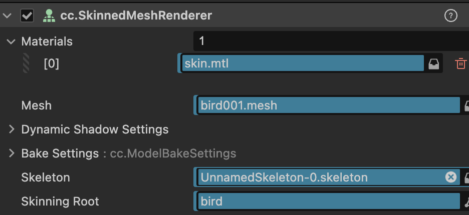

# 遊戲開發 - 模型 Mesh


模型 (Mesh) 是 3D 物體的幾何資料集合，透過 GPU 記憶體緩衝區 (GPU Buffer) 高效地將其頂點、索引等資訊傳送到顯示卡進行繪圖。GPU Rendering Pipeline 中最先執行之 Vertex Shader 的輸入資料即來自 Mesh 的頂點。

## 資料 Mesh Data

Mesh 由多邊形構成，通常以三角形集合來描述，Mesh Data 包含頂點資料(位置、屬性等)與索引資料(三角形組合)。

### 模型檔案


3D 建模軟體可以自由創建 3D Mesh，然後儲存成為模型檔案匯入給遊戲引擎軟體等使用。遊戲開發常用檔案格式有：

1. FBX
- 最廣泛：Autodesk 開發，遊戲引擎首選
- 功能完整：支援動畫、材質、骨骼、攝影機等

2. glTF/GLB
- 新標準：Khronos Group 推動的開放格式
- 效率高：針對實時渲染最佳化
- Web 友好

3. OBJ
- 最簡單：純文字格式，易於理解，但檔案容量也較大
- 輕量級：只包含幾何資料，不支援動畫
- 通用性強：容易支援所以普及

### Vertex

Mesh 構成的最基本資料為頂點 (Vertex)，代表空間中的點。3 個頂點構成 1 三角形，多個三角形構成 Mesh。頂點的必要定義即頂點位置，Computer Graphics 中以頂點屬性 (Attribute) 來表示這種頂點資料定義，以下列出常見之重要頂點屬性：

- **位置 (Position)**：頂點在 3D 空間中的座標 (x, y, z)，定義物體的基本形狀
- **法向量 (Normal)**：垂直於表面的單位向量，用於光照計算 (Lighting) 與背面繪圖剔除 (Back Face Culling)
- **紋理座標 (UV)**：對應到 2D 貼圖的座標 (u, v)
- **顏色 (Color)**：頂點的 RGBA 顏色值，可用於頂點著色

## GPU Buffers

GPU 透過 3 核心緩衝區 (Buffer) 來高效處理 Mesh 資料，以 OpenGL API 角度說明：

### Vertex Buffer Object (VBO)

儲存所有頂點的屬性資料 (位置、法向量、UV、顏色等)，將 CPU 端的頂點陣列上傳至 GPU 記憶體。VBO 採用連續記憶體排列，使 GPU 能夠快速批次讀取頂點資訊。

### Index Buffer Object (IBO)

儲存頂點索引，定義哪些頂點組合成三角形。頂點索引清單中安排共用頂點可以優化減少頂點總量。

### Vertex Array Object (VAO)

封裝 VBO 與 IBO 的綁定狀態，記錄頂點屬性 (Vertex Attribute) 的配置方式 (步幅、偏移量等)。VAO 簡化繪圖呼叫，只需綁定一次即可完成所有緩衝區設定。

## MeshRenderer

遊戲引擎端實現管理 Mesh 資料及繪圖工作，此管理容器常被命名為 MeshRenderer 功能組件。接下來以 Cocos Creator 示範，該組件負責：
- **Mesh 資源管理**：載入 (FBX)、綁定、釋放 Mesh 資源
- **材質整合**：將 Mesh 綁定 Material 進行渲染
- **渲染狀態控制**：管理可見性、陰影投射 (Shadow) 等渲染參數

MeshRenderer 組件管理 Mesh，該 Mesh 可包含多個 Sub-Mesh（Sub-Mesh 容器）。每個 Sub-Mesh 搭配其配對之 Material 設置進行繪圖工作，便算 1 個 **Draw Call**。


### 程序化 Mesh

Cocos Creator 可程序化創建網格，適用於需要動態生成幾何體，如可成長的植物、地形變形、動態建築等。Cocos Creator 提供 2 網格類型：

**靜態網格**：透過 `utils.MeshUtils.createMesh` 創建，一旦建立後幾何體不可編輯
**動態網格**：透過 `utils.MeshUtils.createDynamicMesh` 創建，建立後仍可修改幾何體

```typescript
import { _decorator, Component, MeshRenderer, utils, gfx, Vec3 } from 'cc';

// 建立程序化三角形網格
createTriangleMesh() {
    // 定義頂點資料
    const positions = [
        -1, -1, 0,  // 左下頂點
            1, -1, 0,  // 右下頂點  
            0,  1, 0   // 頂部頂點
    ];
    // 定義法線資料
    const normals = [
        0, 0, 1,
        0, 0, 1,
        0, 0, 1
    ];
    // 定義 UV 座標
    const uvs = [
        0, 0,    // 左下
        1, 0,    // 右下
        0.5, 1   // 頂部
    ];
    // 定義索引
    const indices = [0, 1, 2];
    // 建立靜態網格
    const mesh = utils.MeshUtils.createMesh({
        positions,
        normals,
        uvs,
        indices,
        primitiveMode: gfx.PrimitiveMode.TRIANGLE_LIST
    });
    // 套用到 MeshRenderer
    const meshRenderer = this.getComponent(MeshRenderer);
    if (meshRenderer) {
        meshRenderer.mesh = mesh;
    }
}

/* 程序化動態 Mesh 示範 */

// ...
// 創建 utils.MeshUtils.createDynamicMesh()
for (let i = 0; i < this._options.maxSubMeshes; i++) {
    let geometry: primitives.IDynamicGeometry = {
        positions: this._subMeshes[i].positions,
        normals: this._subMeshes[i].normals,
        minPos: this._subMeshes[i].minPos,
        maxPos: this._subMeshes[i].maxPos,
    }
    this._geometries.push(geometry);
}
const mesh = utils.MeshUtils.createDynamicMesh(0, this._geometries[0], undefined, this._options);
for (let i = 1; i < this._options.maxSubMeshes; i++) {
    mesh.updateSubMesh(i, this._geometries[i]);
}
const meshRenderer = this._dragon.getComponent(MeshRenderer) as MeshRenderer;
meshRenderer.mesh = mesh;
meshRenderer.onGeometryChanged();

// ...
// 動態更新 Dynamic Mesh
if ( _ ) {
    geometry.positions = subMesh.positions.subarray(0, geometry.positions.length + count * 3);
    geometry.normals = subMesh.normals.subarray(0, geometry.normals!.length + count * 3);
    meshRenderer.mesh!.updateSubMesh(i, geometry);
    dirty = true;
}
if(dirty) {
    meshRenderer.onGeometryChanged();
}
```

## 骨骼蒙皮模型渲染 SkinnedMeshRenderer

MeshRenderer 組件提供靜態的幾何模型 (Solid Mesh) 繪圖功能。除此之外，透過骨骼系統控制模型表面變形的模型，稱為骨骼蒙皮模型 (Skinning Mesh) 技術。

### Skinning Mesh

針對模型建立骨架結構 (Skeleton)，將頂點綁定對應控制骨骼 (Bone | Joint)，便可從骨架運動控制蒙皮頂點動畫。

**蒙皮 (Skinning)** 技術重點
- **骨架結構**：骨骼以樹狀層級組織，形成角色的骨架 (Skeleton)
- **頂點權重**：每個頂點可受多個骨骼影響，權重值決定影響程度
- **動態變形**：骨骼運動時，相關頂點根據權重進行位置計算

**SkinnedMeshRenderer** 即負責管理 Skinning Mesh 相關資源 (Skinned Mesh & Skeleton) 與實現蒙皮動畫繪圖功能。

--------------------------------------------------------------
|  項目           |  MeshRenderer    | SkinnedMeshRenderer    |
|----------------|------------------|------------------------|
|  **模型類型**   |  Solid            |  Skinned              |
|  **動畫**       |  節點 (Node)      |  骨骼 (Skeleton)       |
|  **頂點計算**   |  靜態             |  動態蒙皮 (計算成本高)    |
|  **適用**       |  建築、道具        |  角色、生物             |
--------------------------------------------------------------



SkinnedMeshRenderer 是現代遊戲實現生動角色表現的核心技術，雖然計算成本較 MeshRenderer 高，但帶來了豐富的動態表現力。
Cocos Creator 提出 [SkinnedMeshBatchRenderer](https://docs.cocos.com/creator/3.8/manual/zh/module-map/mesh/skinnedMeshBatchRenderer.html) 功能組件實現 GPU Skinning 效能優化方案。

# 參考延伸閱讀

[Cocos Creator 模型資源](https://docs.cocos.com/creator/3.8/manual/zh/asset/model/mesh.html)

[Cocos Creator 程序化创建网格](https://docs.cocos.com/creator/3.8/manual/zh/asset/model/scripting-mesh.html)

[Cocos Creator 骨骼动画](https://docs.cocos.com/creator/3.8/manual/zh/animation/skeletal-animation.html)