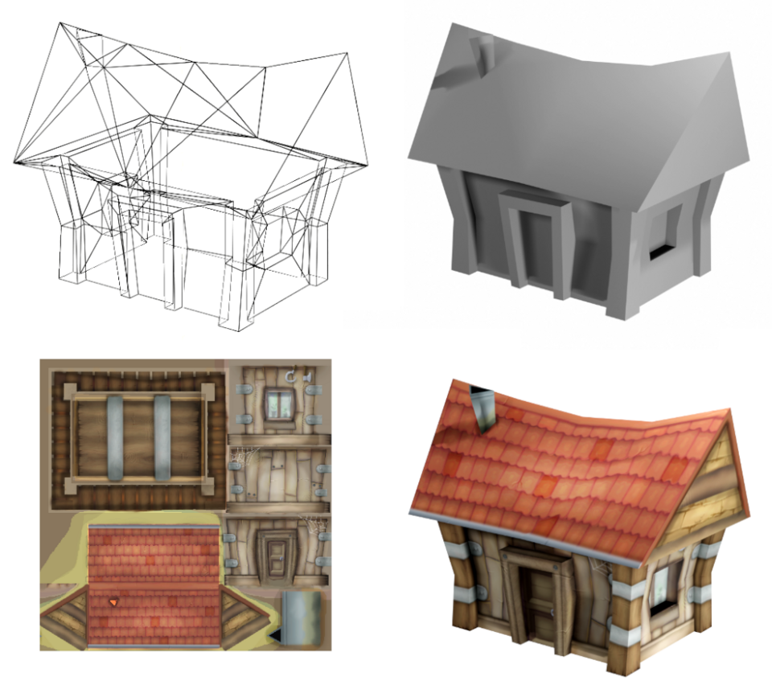

# 遊戲開發 - Texture Mapping

繪圖過程 Fragment Shader 最終要計算出像素的顏色 (Color: [red, green, blue, alpha]) 結果。一般來說顏色可由模型中的頂點顏色 (Vertex Color) 決定，也可以通過材質 (Material) 資料指定的顏色，再來還有來自指定貼圖 (Texture) 的顏色。指定一張貼圖將其色彩映射到指定的模型三角面上的技術即是貼圖映射 (Texture Mapping)。

## 貼圖資源 Texture

貼圖 (Texture) 資源是指用於描述模型表面細節的影像 (Image) 資源，通常以 2D 圖像的形式存儲，常見的貼圖檔案格式包括 BMP、PNG、JPEG、DDS、KTX 等。貼圖可以儲存各種不同目的之資訊，如基本色彩 (Base Color/Diffuse/Albedo)、法線 (Normal)、高光 (Specular)、粗糙度 (Roughness) 等。

軟體程式從硬碟讀取指定影像檔案，將原始像素資訊轉換為 GPU 可識別的格式並上傳至 GPU 顯示記憶體，綁定為貼圖資源物件供 GPU 繪圖用，並且設定其過濾模式 (Filtering)、環繞模式 (Warp) 與 Mipmap 生成等相關 GPU 狀態參數。

## 貼圖映射 Texture Mapping

將 2D 圖像 (Texture) 映射到 3D 模型表面的技術，讓模型表面呈現更豐富的視覺效果。

早期 Rasterization 流程像素顏色由 Vertex Color 經過線性插值或由材質 (Material) 指定的固定顏色決定。隨著視覺需求提升因而提出 Texture Mapping 技術：在 Fragment Shader 中使用 Vertex Shader 端輸入的 UV 座標對指定 2D 貼圖進行採樣 (Texture Sampling)，獲取對應位置的貼圖紋理像素顏色 (Texel Color)，可用在與其他顏色資訊混合輸出豐富像素顏色結果。

### 貼圖座標 UV Coordinates

貼圖座標系統使用 U、V 兩個軸向來定位貼圖上的像素位置，U 軸代表影像水平方向，V 軸代表影像垂直方向，座標範圍為 [0, 1]。UV 座標（Texture Coordinate）的原點通常位於貼圖的左下角（視不同 Graphics API 而定）。模型中每個頂點除了帶有物件空間位置（Object Space Coordinate），還會定義對應的 UV 座標，用於指定該頂點在映射貼圖上的採樣位置。

### 貼圖採樣 Texture Sampling

在 Rasterization (光柵化)階段，GPU 對三角形內部每個像素進行線性插值計算出 UV 座標，並根據指定貼圖綁定時設定的過濾 (Texture Filtering) 與環繞模式 (Texture Wrap Mode) 參數，使用 GPU 硬體採樣單元 (Texture Sampler/Texture Mapping Unit, TMU) 讀取對應位置的顏色值（Texel: [r, g, b, a]）。

### Texture Filtering

由於貼圖解析度與螢幕像素解析度可能不同，在採樣時需要進行過濾處理：

1. 最近點採樣 (Nearest Point Sampling)
   - 直接取最接近的貼圖像素值
   - 優點：計算簡單
   - 缺點：可能產生鋸齒狀邊緣

2. 線性過濾 (Linear Filtering)
   - 對相鄰的貼圖像素進行線性內插
   - 優點：平滑的過渡效果
   - 缺點：可能造成模糊

3. 各向異性過濾 (Anisotropic Filtering)
   - 考慮視角方向的過濾方式
   - 優點：改善斜向紋理的清晰度
   - 缺點：計算量較大

### 貼圖壓縮 Texture Compression

為了減少記憶體使用和頻寬消耗，貼圖通常會進行壓縮：

1. 無損壓縮
   - 保持原始圖像品質
   - 壓縮率較低

2. 有損壓縮
   - 允許一定程度的品質損失
   - 壓縮率較高
   - 常用格式：DXT、ETC、ASTC

# 參考延伸閱讀

