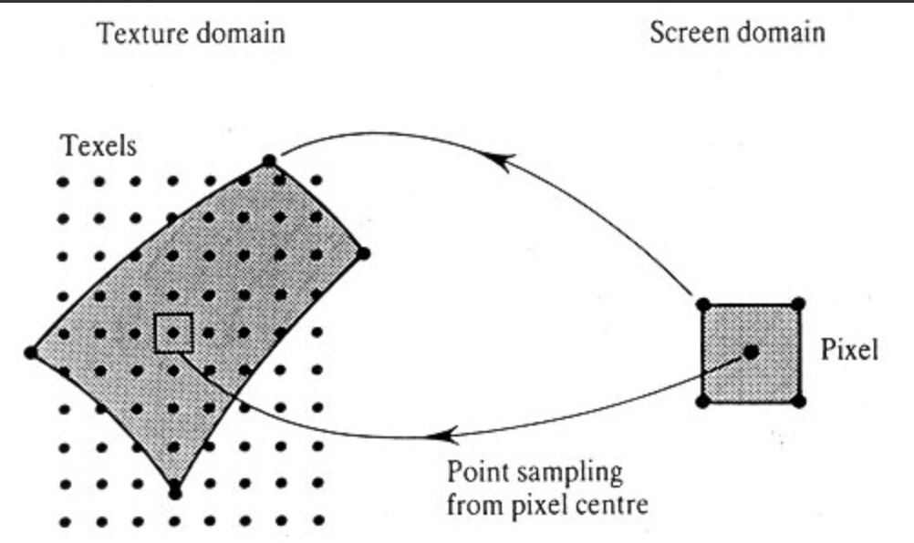

# 遊戲開發 - 貼圖 Texture

繪圖過程 Fragment Shader 最終要計算出像素的顏色 (Color: [red, green, blue, alpha])。一般來說顏色可由模型中的頂點顏色 (Vertex Color) 決定，也可通過材質 (Material) 指定顏色，再來還有來自指定貼圖 (Texture) 的顏色。指定一張貼圖將其色彩映射到指定的模型三角面上的技術即是貼圖映射 (Texture Mapping)。

## 貼圖資源 Texture

貼圖 (Texture) 資源是指用於描述模型表面細節紋理的影像 (Image) 資源，通常以 2D 圖像的形式儲存，常見的貼圖檔案格式包括 BMP、PNG、JPEG、DDS、KTX 等。貼圖可以儲存各種不同目的之資訊，如基本色彩 (Base Color/Diffuse/Albedo)、法線 (Normal)、高光 (Specular)、粗糙度 (Roughness) 等。

軟體程式從硬碟讀取指定影像檔案，將原始像素資訊轉換為 GPU 可識別的格式並上傳至 GPU 顯示記憶體，綁定為貼圖資源物件供 GPU 繪圖用，並可設定其過濾模式 (Filtering)、環繞模式 (Wrapping) 與多層級紋理 (Mipmap) 生成等相關 GPU 狀態參數。

### Texel

Texel（Texture Element）是貼圖的最小取樣單位，相當影像中的像素。Texel 通常以 4 分量向量儲存數據，如顏色 ([r, g, b, a]) 或其他自訂資訊 ([x, y, z, w])。影像檔案的顏色通常採用 sRGB (伽瑪色彩空間，Gamma Color Space) 儲存。

## 貼圖映射 Texture Mapping

將 2D 圖像 (Texture) 映射到 3D 模型表面的技術，讓模型表面呈現更豐富的視覺效果。

早期 Rasterization 流程像素顏色由 Vertex Color 經過線性插值或由材質 (Material) 指定決定。隨著視覺需求提升因而提出 Texture Mapping 技術：在 Fragment Shader 中使用 Vertex Shader 端輸入的 UV 座標對指定 2D 貼圖進行採樣 (Texture Sampling)，獲取對應位置的貼圖紋理像素顏色 (Texel Color)，可用在與其他顏色資訊混合輸出豐富像素顏色結果。

### UV Coordinates

貼圖座標系統使用 U、V 兩個軸向來定位貼圖上的像素位置，U 軸代表影像水平方向，V 軸代表影像垂直方向，座標範圍為 [0, 1]。UV 座標（Texture Coordinate）的原點通常位於貼圖的左下角或左上角（視不同 Graphics API 而定）。模型中每個頂點除了帶有物件空間位置（Object Space Coordinate），還會定義對應的 UV 座標，用於指定該頂點在映射貼圖上的採樣位置。

### Texture Sampling

在 Rasterization (光柵化)階段 GPU 對三角形內部每個像素進行線性插值計算出 UV 座標，並根據指定貼圖綁定時設定的過濾 (Texture Filtering) 與環繞模式 (Texture Wrapping) 參數，使用 GPU 貼圖採樣單元 (Texture Sampler/Texture Mapping Unit, TMU) 讀取對應位置的顏色值（Texel: [r, g, b, a]）。

例如 Fragment Shader 階段計算得到 UV 座標為 [0.5, 0.5]，對一張解析度 100×100 之綁定貼圖採樣，相當於讀取(取樣)該貼圖影像中 [50, 50] 的紋理元素回傳為 Texel Color。

### Texture Filtering

貼圖過濾功能，透過不同的過濾算法平滑或細化取樣結果，達到減少鋸齒或模糊現象。

1. 最近點採樣 (Nearest Point)
   - 直接取最接近的貼圖像素值；優點：計算簡單；缺點：鋸齒狀邊緣(像素風格)。
2. 線性過濾 (Linear Filtering)
   - 對相鄰的貼圖像素線性內插；優點：平滑過渡效果；缺點：可能造成模糊。
3. 各向異性過濾 (Anisotropic Filtering)
   - 考慮視角方向的過濾方式；優點：改善斜向紋理的清晰度；缺點：計算量較大。

### Texture Wrapping

環繞模式決定當 UV 座標超出 [0, 1] 範圍時如何處理。

1. 重複 (Repeat)：超出範圍的 UV 的小數部分用於重複採樣貼圖
2. 鏡像重複 (Mirrored Repeat)
3. 剪裁至邊界 (Clamp)：當 UV 值超出 [0, 1] 範圍時，坐標被限制在邊界值（0 或 1），並採樣貼圖邊緣像素。

### Texture Mipmapping

多級紋理貼圖 (Mipmap) 是在貼圖資源中預先生成一組逐級降低解析度的貼圖，後續層級的尺寸皆為前一層的一半，直到最小為 1×1。例如對於一張解析度 512×512 的貼圖，會依次生成 512x512、256x256、128x128、64x64、32x32、16x16、8x8、4x4、2x2、1x1 共 10 個層級。注意：因需要額外準備多個層級的紋理貼圖故需要更多記憶體佔用量 (平均約多 33%)。

Fragment Shader 階段時依據像素片段在螢幕上的紋理覆蓋度（Texture Footprint）動態計算層級細節 (Level of Detail, LOD) 決定對應的 Mipmap 層進行 Texture Mapping，以選用最匹配顯示比例的貼圖解析度，改善高頻細節取樣不足所產生的鋸齒 (Aliasing) 及閃爍 (Shimmering) 現象。

常見的 Mipmap 採樣策略包括：
- GL_NEAREST_MIPMAP_NEAREST：選擇最接近的層級後，對該層使用最近點過濾。
- GL_LINEAR_MIPMAP_NEAREST：選擇最接近的層級後，對該層使用線性過濾。
- GL_NEAREST_MIPMAP_LINEAR：在兩個最接近層級之間先進行層級插值，再對結果使用最近點過濾。
- GL_LINEAR_MIPMAP_LINEAR：在兩個最接近層級之間先進行層級插值，再對結果使用線性過濾（又稱 Trilinear 過濾）。

# 參考延伸閱讀

