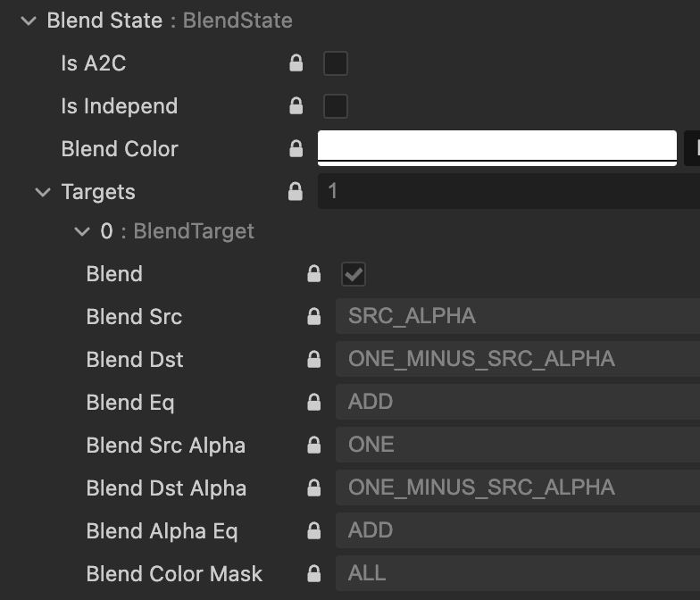

# 遊戲開發 - GPU 顏色混合 Blending

Blending 位於 GPU Graphics Pipeline 處理中 Per-Fragment Operations 階段，混合新舊像素顏色，實現透明、發光等特效。

## 透明 Transparent

透明效果讓物體呈現半透明或完全透明狀態。在 Graphics Pipeline 中顏色的透明度透過 Alpha 通道控制。透明物體不覆蓋背景，而與後方像素進行顏色混合。常見透明混合顏色公式：

```math
\begin{aligned}
&C_{out} = C_{source} \times \alpha_{source} + C_{destination} \times (1 - \alpha_{source}) \\
\\
&\text{其中：} \\
&C_{source} : \text{新繪製來源像素顏色} \\
&C_{destination} : \text{Frame Buffer 中目標像素原有顏色} \\
&\alpha_{source} : \text{新來源像素的透明度值}
\end{aligned}
```

### 透明繪圖排序

透明繪圖顏色使用混合顏色公式計算得出，公式的前提是新的來源透明顏色與之前的透明顏色混合，因此繪圖順序會直接影響顏色結果。透明顏色混合公式不具交換性，A 混合 B 與 B 混合 A 會產生不同顏色。不透明物體繪圖依賴 Depth Buffer (Z-Buffer) 深度測試自動解決遮擋，透明物體繪圖則無法寫入深度，因為會錯誤地覆蓋後方物體繪圖結果。

解決方案：**從後往前繪圖 (Back-to-Front)**


透明物體關閉寫入深度，按物體到攝影機距離排序，依序先從較遠物體至較近物體繪圖，確保混合順序正確。遊戲引擎/繪圖引擎都會正確處理透明物件之由後至前排序工作，但也伴隨著(CPU 端)計算代價。

### 透明透空 Alpha Test


透明透空繪圖 (Alpha Test) 是透明度處理的替代方案，透過設定透明度閾值 (Threshold) 決定像素保留或丟棄，略過顏色混合運算。透明度低於閾值(如 0.5)的像素會被 GPU 放棄執行處理 (Discard)，高於閾值則當作完全不透明繪圖處理(並寫入深度)。透明透空無法產生平滑的透明漸變效果，邊緣易出現鋸齒 (Aliasing) 現象，適合用於有明確透明邊界的材質，如植物葉片、鐵絲網、UI 圖示等，不適合玻璃、煙霧等需要漸變透明的效果。

## Blend 狀態



GPU 透過「Blend 狀態參數」來控制來源像素 (Source) 與目標像素 (Destination) 的顏色混合方式。這些參數可使用 Graphics API 設置，下述介紹以 OpenGL 為前提：

- **Blend Enable (啟用混合)**  
  是否啟用顏色混合。若關閉，來源像素會直接覆蓋目標像素。

- **Blend Equation (混合方程式)**  
  決定來源與目標顏色如何組合。常見選項有：
  - `FUNC_ADD`：Source + Destination
  - `FUNC_SUBTRACT`：Source - Destination
  - `FUNC_REVERSE_SUBTRACT`：(反向相減) Destination - Source

- **Blend Factor (混合因子)**  
  控制來源與目標顏色在混合時的權重係數。因子有：
  - `ZERO` (0)
  - `ONE` (1)
  - `SRC_ALPHA` (Source_Alpha)
  - `ONE_MINUS_SRC_ALPHA` (1 - Source_Alpha)
  - `DST_ALPHA` (Destination_Alpha)
  - `ONE_MINUS_DST_ALPHA` (1 - Destination_Alpha)
  - `SRC_COLOR` (Source_Color)
  - `ONE_MINUS_SRC_COLOR` (1 - Source_Color)
  - `DST_COLOR` (Destination_Color)
  - `ONE_MINUS_DST_COLOR` (1 - Destination_Color)

- **Color Mask (顏色遮罩)**  
  控制哪些顏色通道（R/G/B/A）允許寫入 Frame Buffer。

- **Blend Color (混合常數顏色)**  
  某些混合模式下可指定一個常數顏色參與混合。

Graphics Pipeline 在 Fragment Shader 回傳顏色結果後，便以 Blend 狀態參數執行指定的混合公式，計算出最終顏色結果，該過程通用混合公式：

```math
\begin{align}
C_{out} &= C_{src} \times F_{src} \oplus C_{dst} \times F_{dst} \\
\\
\text{其中：} \\
C_{out} &: \text{最終寫入 Frame Buffer 的顏色向量 (R, G, B, A)} \\
C_{src} &: \text{來源顏色（Fragment Shader 輸出）} \\
C_{dst} &: \text{目標顏色（Frame Buffer 原有值）} \\
F_{src} &: \text{來源混合因子（Source Blend Factor）} \\
F_{dst} &: \text{目標混合因子（Destination Blend Factor）} \\
\oplus &: \text{Blend Equation（如 Add, Substract, Reverse Substract）}
\end{align}
```

不同的混合模式（如 Alpha Blending、Additive Blending 等）就是透過調整 F_src 與 F_dst 來實現。

## 透明效果

GPU 使用 Blending 可實現多樣化的透明顏色混合，在繪圖或遊戲畫面中，常見的主流透明混合效果有：
- Alpha Blending (Alpha 混合)
- Additive Blending (加法混合)
- Screen/Multiply/Overlay

### Alpha Blending

最常見的透明繪圖透明混色方法，透過 Alpha 通道控制物體透明度，實現玻璃、水霧面等效果。透明物體需要從後往前排序繪製，確保混合顏色計算正確，同時關閉深度寫入以避免遮擋後方物體。

**設置參數：**
- Source Factor: `SRC_ALPHA`
- Destination Factor: `ONE_MINUS_SRC_ALPHA`
- Blend Equation: `FUNC_ADD`
- Alpha Source Factor: `ONE`
- Alpha Destination Factor: `ONE_MINUS_SRC_ALPHA`
- Alpha Blend Equation: `FUNC_ADD`

**公式：**
```math
\begin{aligned}
&C_{out} = C_{src} \times \alpha_{src} + C_{dst} \times (1 - \alpha_{src}) \\
&\alpha_{out} = \alpha_{src} \times 1 + \alpha_{dst} \times (1 - \alpha_{src}) \\
\\
&\alpha_{src} \text{ 值範圍 } 0 \sim 1 \text{：} \\
&\alpha = 0 \text{：完全透明} \\
&\alpha = 1 \text{：完全不透明} \\
&\alpha = 0.5 \text{：50\% 透明度}
\end{aligned}
```

### Additive Blending

製作發光效果的最主流透明方案，適用於如火焰、煙花、鐳射光束等特效。將來源顏色直接疊加到目標顏色上，使畫面變得更亮更鮮豔。加法混合的特點是越疊加越亮，需注意顏色亮度太亮的問題(顏色加總逼近白色)。

**設置參數：**
- Source Factor: `SRC_ALPHA` 或 `ONE`
- Destination Factor: `ONE`
- Blend Equation: `FUNC_ADD`
- Alpha Source Factor: `SRC_ALPHA` 或 `ONE`
- Alpha Destination Factor: `ONE`
- Alpha Blend Equation: `FUNC_ADD`

**公式：**
```math
\begin{aligned}
&C_{out} = C_{src} \times F_{src} + C_{dst} \times 1.0 \\
&\alpha_{out} = \alpha_{src} \times F_{src} + \alpha_{dst} \times 1.0 \\
\\
&\text{常見組合：} \\
&C_{out} = C_{src} \times \alpha_{src} + C_{dst} \times 1.0 \quad \text{(SRC\_ALPHA, ONE)} \\
&\alpha_{out} = \alpha_{src} \times \alpha_{src} + \alpha_{dst} \times 1.0 \\
&C_{out} = C_{src} \times 1.0 + C_{dst} \times 1.0 \quad \text{(ONE, ONE)} \\
&\alpha_{out} = \alpha_{src} \times 1.0 + \alpha_{dst} \times 1.0 \\
\\
&\text{效果特性：} \\
&\text{• 顏色值只會增加，不會減少，黑色 [0, 0, 0] 不會影響最終顏色}
\end{aligned}
```

### Screen

Screen 混合是一種類似於加法混合但更為柔和的混合模式，模擬多層光線投影的效果。常用於製作柔和的光暈、雲朵、煙霧等需要自然融合的特效。Screen 混合會讓畫面變亮，但不會像加法混合那樣容易過曝，產生更自然的亮度提升效果。

**設置參數：**
- Source Factor: `ONE_MINUS_DST_COLOR`
- Destination Factor: `ONE`
- Blend Equation: `FUNC_ADD`
- Alpha Source Factor: `ONE_MINUS_DST_ALPHA`
- Alpha Destination Factor: `ONE`
- Alpha Blend Equation: `FUNC_ADD`

**公式：**
```math
\begin{aligned}
&C_{out} = C_{src} \times (1 - C_{dst}) + C_{dst} \times 1.0 \\
&\alpha_{out} = \alpha_{src} \times (1 - \alpha_{dst}) + \alpha_{dst} \times 1.0 \\
\\
&\text{效果特性：} \\
&\text{• 結果顏色永遠不會比輸入顏色更暗，白色 [1, 1, 1] 會產生白色輸出}
\end{aligned}
```

### Multiply

Multiply 混合是將來源顏色與目標顏色相乘的混合模式，產生比原始顏色更暗的結果。常用於製作陰影、暗化效果、色彩濾鏡等，適合用於疊加陰影或暗部細節。

**設置參數：**
- Source Factor: `DST_COLOR`
- Destination Factor: `ZERO`
- Blend Equation: `FUNC_ADD`
- Alpha Source Factor: `DST_ALPHA`
- Alpha Destination Factor: `ZERO`
- Alpha Blend Equation: `FUNC_ADD`

**公式：**
```math
\begin{aligned}
&C_{out} = C_{src} \times C_{dst} + C_{dst} \times 0.0 \\
&\alpha_{out} = \alpha_{src} \times \alpha_{dst} + \alpha_{dst} \times 0.0 \\
\\
&\text{效果特性：} \\
&\text{• 結果顏色永遠不會比輸入顏色更亮，黑色 [0, 0, 0] 會產生黑色輸出}
\end{aligned}
```

### Overlay

Overlay 混合結合了 Multiply 和 Screen 的特性，根據目標顏色的亮度決定使用哪種混合方式。對於較暗的區域使用 Multiply 混合，對於較亮的區域使用 Screen 混合，產生對比度增強的效果。常用於色彩校正、特殊濾鏡效果、增強材質對比度等應用。

**設置參數：**
- Source Factor: `ONE`
- Destination Factor: `ZERO`
- Blend Equation: `FUNC_ADD`
- Alpha Source Factor: `ONE`
- Alpha Destination Factor: `ZERO`
- Alpha Blend Equation: `FUNC_ADD`
- **實現方式：** Fragment Shader 中計算條件判斷邏輯後直接輸出最終顏色

**公式：**
```math
\begin{aligned}
&\text{條件判斷：} \\
&\text{if } C_{dst} < 0.5: \\
&\quad C_{out} = 2 \times C_{src} \times C_{dst} \\
&\text{else:} \\
&\quad C_{out} = 1 - 2 \times (1 - C_{src}) \times (1 - C_{dst}) \\
\\
&\text{Alpha 通道：} \\
&\text{if } \alpha_{dst} < 0.5: \\
&\quad \alpha_{out} = 2 \times \alpha_{src} \times \alpha_{dst} \\
&\text{else:} \\
&\quad \alpha_{out} = 1 - 2 \times (1 - \alpha_{src}) \times (1 - \alpha_{dst}) \\
\\
&\text{效果特性：} \\
&\text{• 增強對比度，暗部更暗，亮部更亮} \\
&\text{• 中性灰 [0.5, 0.5, 0.5] 不會改變目標顏色}
\end{aligned}
```

# 參考延伸閱讀

[OpenGL Blending](https://www.khronos.org/opengl/wiki/blending)

[WebGL Blend Demo](https://mrdoob.github.io/webgl-blendfunctions/blendfunc.html)