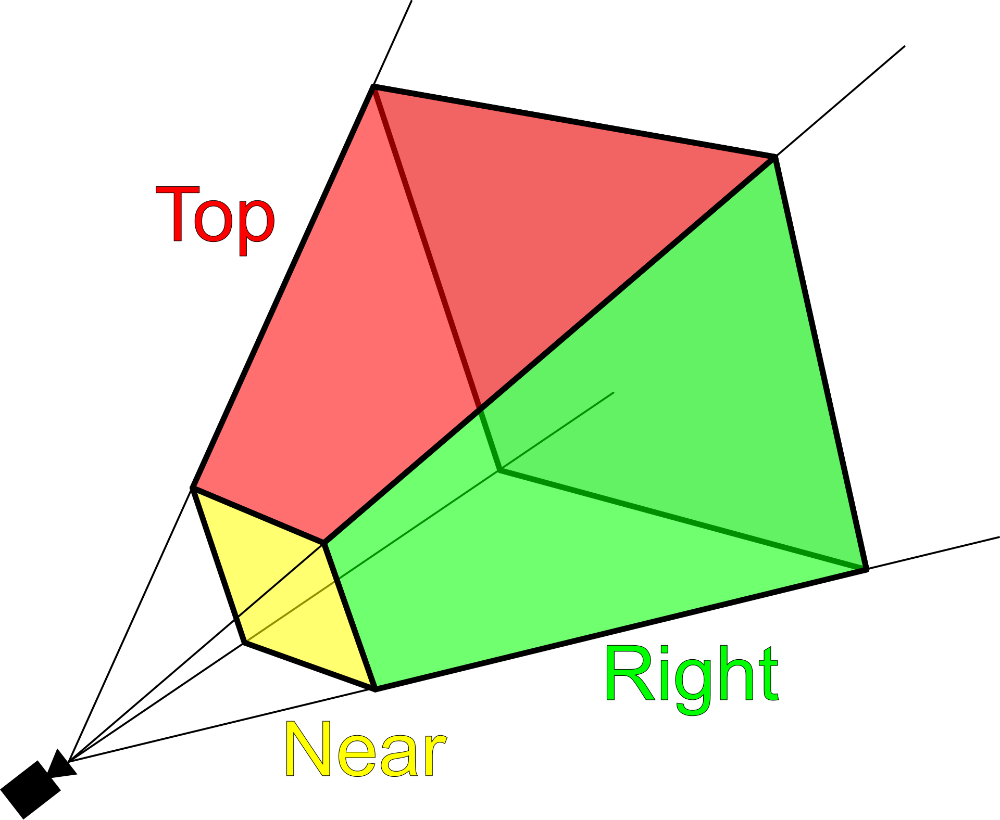

# 遊戲開發 - 繪圖剔除與裁剪 Culling & Clipping

世界中所有的物體無法盡收眼底，相機不可見的物體仍進行繪圖處理的話便會浪費效能。Graphics Pipeline 中剔除 (Culling) 與裁剪 (Clipping) 是優化渲染效能的重要技術，透過排除不可見或超出可視範圍的幾何體，減少不必要的繪圖計算。

## 剔除 Culling

繪圖剔除技術在繪圖管線早期階段排除不可見的幾何體，避免將這些物件送入 GPU 進行後續處理，大幅降低 GPU 繪圖工作負擔。

### 視錐剔除 Frustum Culling



視錐剔除 (Frustum Culling) 是最基礎且重要的剔除技術，排除位於相機視錐 (View Frustum) 範圍外的物件。 View Frustum 定義相機的可視範圍，由 6 個平面 (Near、Far、Left、Right、Top、Bottom) 構成類三角錐體。Frustum Culling 演算法即判定繪圖對象幾何體是否位於 View Frustum 範圍內：

**步驟：**
1. **建構視錐 6 平面**：從 View-Projection Matrix 提取 Near、Far、Left、Right、Top、Bottom 6 個裁剪平面
2. **取得物件包圍體**：對每個物件取其包圍體 (Bounding Volume，常用 AABB 或 Bounding Sphere)
3. **逐平面測試**：Bounding Volume 與 6 個平面逐一做半空間測試 (Half-Space Test)
   > **Half-Space Test**：利用點與平面的數學公式 $D = \mathbf{P} \cdot \mathbf{N} + d$ 計算符號距離。
   > - $D > 0$：點在平面正向（內側/可見側）
   > - $D < 0$：點在平面反向（外側/不可見側）
   > - $D = 0$：點在平面上
   > 
   > 對於球體 (Sphere)，若中心點距離 $D < -Radius$，則該球體完全位於平面外側（剔除）。
4. **判定結果**：
   - **完全或部分在內側 (Inside | Intersected)**：物件可見，送入繪圖管線
   - **完全在外側 (Outside)**：物件不可見，直接剔除跳過繪製

視錐剔除處理在 CPU 端執行，屬 Graphics Pipeline 之應用階段 (Application Stage) 完成。

### 背面剔除 Back Face Culling

![back face culling]

背面剔除 (Back Face Culling) 排除背對相機的三角形面。不透明物體之背面不可見故無需繪製；透明物體情況則不適用。Back Face Culling 屬於 Graphics Fixed Function Pipeline 的功能，GPU 硬體直接支援，開發者透過 Graphics API 啟用剔除並定義正面的頂點繞序 (Winding Order)：順時針或逆時針。

```c
// Back Face Culling 在 Vertex Shader 執行之後的 Primitive Assembly 階段執行(先頂點變換才座標空間後決定螢幕空間的三角形面向)
glEnable(GL_CULL_FACE); // 啟用背面剔除
glFrontFace(GL_CCW); // (OpenGL 預設)逆時針繞序為正面；CCW = Counter Clock Wise；CW = Clock Wise；
glCullFace(GL_BACK); // 剔除背面 (也可指定 GL_FRONT)
```

## 裁剪 Clipping

裁剪 (Clipping) 處理部分位於視圖範圍內的幾何體，將超出範圍的部分切除，只保留可見區域進行後續渲染。

### 視錐裁剪 View Frustum Clipping

![clipping]

視錐裁剪在投影轉換後執行，將位於 Clip Space 範圍外的頂點與三角形進行裁剪。Clip Space 定義為正規化座標範圍 [-1, -1, -1] ~ [1, 1, 1] 的立方體空間。

**裁剪平面：**

```math
\begin{aligned}
&\text{Clip Space 裁剪條件：} \\
&-w \leq x \leq w \\
&-w \leq y \leq w \\
&-w \leq z \leq w \\
&\text{其中 } w \text{ 為齊次座標的 } w \text{ 分量}
\end{aligned}
```

**Sutherland-Hodgman 裁剪算法：**

經典的多邊形裁剪算法，依序對每個裁剪平面進行裁剪操作。

```glsl
// GPU 硬體自動執行裁剪，Vertex Shader 輸出 gl_Position 後
// GPU 會自動處理超出 Clip Space 的圖元
void main() {
    // 計算 Clip Space 座標
    gl_Position = projectionMatrix * modelViewMatrix * vec4(position, 1.0);
    // GPU 自動裁剪超出範圍的部分
}
```

### 視口裁剪 Viewport Clipping

視口裁剪將 Clip Space 座標轉換到屏幕座標時，自動排除超出視口 (Viewport) 範圍的像素。視口定義實際繪圖的屏幕區域。

## 剔除與裁剪的執行時機

![pipeline culling clipping]

GPU 繪圖管線中，剔除與裁剪在不同階段執行：

1. **應用階段 (Application)**：視錐剔除、遮擋剔除
2. **幾何處理階段 (Geometry Processing)**：背面剔除
3. **光柵化階段 (Rasterization)**：視錐裁剪、視口裁剪、屏幕裁剪

## 效能優化

剔除與裁剪技術是遊戲渲染效能優化的核心：

- **減少 Draw Call**：剔除不可見物件，降低 CPU 端繪圖指令提交
- **減少頂點處理**：避免處理不可見幾何體的頂點著色器運算
- **減少片段處理**：避免處理不可見像素的片段著色器運算
- **降低記憶體頻寬**：減少不必要的資料傳輸

現代遊戲引擎會結合多種剔除技術，在 CPU 與 GPU 端協同工作，最大化渲染效能。

# 參考延伸閱讀
