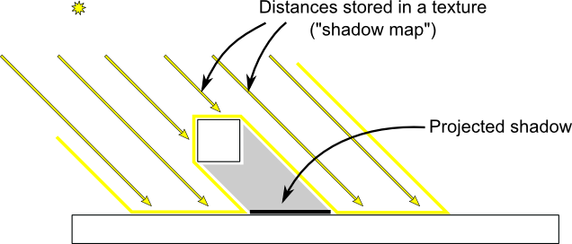
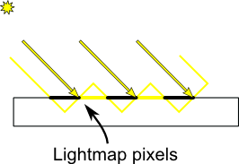

# 遊戲開發 - 動態陰影 Real Time Shadow

即時渲染 (Real-time Rendering) 中最主流的動態陰影技術為 **Shadow Map** (陰影貼圖)。以下介紹各代主要技術。

## 陰影體 Shadow Volume


Shadow Volume 為早期主流技術，透過建構燈光實際投射之陰的幾何體，即時繪製出陰影變暗的效果。核心概念：將遮擋物的輪廓延展形成封閉的 3D 陰影體，再利用 Stencil Buffer 判斷像素片段是否在陰影體內部 (代表遊戲：Doom 3)。

*   **優點**：幾何精確度 (Pixel-perfect)，**完全沒有 Aliasing**。
*   **缺點**：
    *   陰影體覆蓋範圍極大，Rasterizer 大量 Overdraw，極度消耗 Stencil Buffer 頻寬。
    *   CPU / Geometry Shader 輪廓幾何計算昂貴。
    *   難以實現 Soft Shadow。

## 陰影貼圖 Shadow Mapping

Shadow Map 是基於影像空間的即時渲染技術，核心概念：「**片段若不在光源可視範圍內，則處於陰影中**」。直覺上，光源能「看到」的表面就是被照亮的；看不到的就處於陰影中。

演算法包含兩個 Pass：
1.  **Shadow Pass**：以光源為 Camera 渲染場景，將被照射物體的深度輸出至深度紋理 (Shadow Map)。硬體僅寫入 Depth Buffer (Depth-only Pass)。
2.  **Lighting Pass**：物件繪圖階段將像素片段世界座標轉換至光源空間，比較當前深度與 Shadow Map 紀錄深度——若當前深度較大(遠，代表被遮擋)即為陰影。



繪圖過程中 Fragment Shader 執行 Lighting Pass 深度比較之前，需計算將像素座標空間從 **World Space → Light Clip Space → [0, 1] 深度範圍**：

```math
\begin{aligned}
x_{clip} &= M_{proj}^{light} \times M_{view}^{light} \times x_{world}
  & \text{World Space} &\rightarrow \text{Light Clip Space} \\
D_{current-light} &= \frac{x_{clip}.z}{x_{clip}.w} \times 0.5 + 0.5
  & \text{Light Clip Space} &\rightarrow [0, 1] \text{ 深度}
\end{aligned}
```

*   $x_{clip}$：像素片段經光源 View-Projection 轉換後的 Clip Space 座標。
*   $D_{current-light}$：該像素片段相對於光源的深度值，用於與 Shadow Map 中儲存的深度比較。

### Shadow Acne

由於 Shadow Map 解析度是有限的，深度值存在量化誤差；當表面與光線越接近平行(掠射角)，同一 Texel 覆蓋的深度範圍越大，容易造成像素片段自身被誤判為遮擋——這就是 **Shadow Acne**。常見解法是加入 **Depth Bias**，依表面傾斜程度動態調整偏移量。



### 示範 Fragment Shader

```glsl
float CalculateShadow(vec4 fragPosLightSpace) {
    // 透視除法：齊次座標 (Homogeneous Coordinates) → 歸一化設備座標 (Normalized Device Coordinates, NDC)
    vec3 proj = fragPosLightSpace.xyz / fragPosLightSpace.w;
    // NDC [-1,1] 映射到 [0,1]，配合 shadow map UV 與深度範圍
    proj = proj * 0.5 + 0.5;
    // 超出光源遠平面 → 認定不在陰影中
    if (proj.z > 1.0)
      return 0.0;

    // 從 shadow map 取得離光源最近的深度
    float closestLitDepth = texture(shadowMap, proj.xy).r;
    // bias 隨表面傾斜程度增大，防止 shadow acne
    float bias = max(0.05 * (1.0 - dot(normal, lightDir)), 0.005);
    // 片段深度 > shadow map 深度 → 被遮擋(1.0)，否則無陰影(0.0)
    return (proj.z - bias > closestLitDepth) ? 1.0 : 0.0;
}
```

## 進階技術

以下簡單介紹進階的 Shadow Map 技術。

### Percentage-Closer Filtering (PCF)

基礎 Shadow Map 邊緣有嚴重鋸齒狀 (Aliasing)。PCF 在 Fragment Shader 中對 Shadow Map 鄰近 Texels 多次採樣比較，平均**測試結果**，而非模糊深度貼圖本身。這是最常見的 Soft Shadow 做法。

### Cascaded Shadow Maps (CSM)

單 Shadow Map 在大型場景會產生嚴重 Perspective Aliasing (距 Camera 近處解析度不足)。CSM 將 View Frustum 沿 $Z$ 軸切割為多層 Cascade，每層在 Shadow Pass 各自渲染獨立的 Shadow Map。Fragment Shader 依片段深度選擇對應層級採樣。

### Variance Shadow Maps (VSM)

PCF 無法利用硬體 Mipmap / Bilinear Filtering。VSM 在 Shadow Pass 將 $d$ 與 $d^2$ 寫入紋理，Fragment Shader 以 Chebyshev's inequality 估算陰影機率，可直接對 Shadow Map 套用 Gaussian Blur 等硬體加速過濾。

### 效能優化

Shadow Map 的效能代價主要來自 Shadow Pass 繪圖工作所需要的 Draw Calls、Overdraw 與 Shadow Map 紋理讀寫的記憶體頻寬 (Memory Bandwidth)。以下為常見的優化基本功：

*   **Frustum Culling**：用光源視錐剔除不可見物件，減少 Shadow Pass Draw Call。
*   **Shadow Proxy**：Shadow Pass 僅需深度，用 Low-poly LOD 取代，省 Vertex ALU 與 Bandwidth。
*   **關閉 Color Write**：Shadow Pass 無顏色輸出需求，關閉省頻寬。
*   **Front-Face Culling**：僅渲染背面寫入深度，利用幾何厚度解決 Shadow Acne，免調 Depth Bias。
*   **Early-Z**：Shadow Pass 物件由近到遠排序渲染，最大化硬體 Early-Z 剔除冗餘片段。

## 光源實現投射陰影

場景中一盞 Light 要能實現投射陰影，就必須產生對應的 Shadow Map。不同類型的光源在 Shadow Pass 使用不同的投影方式產生 Shadow Map：

### Directional Light

方向光沒有位置，光線平行射入。Shadow Pass 使用**正交投影 (Orthographic Projection)** 渲染 Shadow Map，投影範圍需涵蓋 Camera 可視區域內的場景物件。

*   正交投影不存在近大遠小，Shadow Map 各處解析度均勻。
*   大型場景中單一 Shadow Map 解析度不足，實務上可搭配 **CSM** 分層處理。

### Point Light

點光源向所有方向發光，需用 **Cubemap Shadow Map**——以點光源為原點，對 6 個軸向 (+X, -X, +Y, -Y, +Z, -Z) 各用 90 度視野展開角度 (Field of View, FOV) 的**透視投影 (Perspective Projection)** 渲染 Shadow Map。6 面恰好涵蓋完整球面，共產生 6 張 Shadow Map。

*   Fragment Shader 以光源到片段的方向向量採樣 Cubemap，取得對應方向的最近深度。
*   渲染成本為其他光源的 **6 倍**，是效能優化的重點對象。

### Spot Light

聚光燈有位置與方向，照射範圍為圓錐體。Shadow Pass 使用**透視投影 (Perspective Projection)**，視野展開角度設為聚光燈外圈張角 (Outer Cutoff Angle) 之 2 倍，使投影範圍恰好涵蓋照射錐體。

# 參考延伸閱讀

[Shadow Volume](https://en.wikipedia.org/wiki/Shadow_volume)

[Shadow Mapping](https://en.wikipedia.org/wiki/Shadow_mapping)

[Shadow Mapping - OpenGL Tutorial](https://www.opengl-tutorial.org/intermediate-tutorials/tutorial-16-shadow-mapping/)