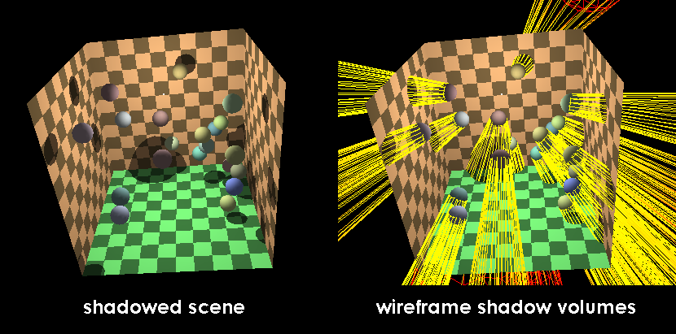

# 遊戲開發 - 動態陰影 Real Time Shadow

即時渲染 (Real-time Rendering) 中最主流的動態陰影技術為 **Shadow Map** (陰影貼圖)。以下介紹各代主要技術。

## 陰影體 Shadow Volume



Shadow Volume 為早期主流技術，透過建構燈光實際投射之陰的幾何體，即時繪製出陰影變暗的效果。核心概念：將遮擋物的輪廓延展形成封閉的 3D 陰影體，再利用 Stencil Buffer 判斷像素片段是否在陰影體內部 (代表遊戲：Doom 3)。

*   **優點**：幾何精確度 (Pixel-perfect)，**完全沒有 Aliasing**。
*   **缺點**：
    *   陰影體覆蓋範圍極大，Rasterizer 大量 Overdraw，極度消耗 Stencil Buffer 頻寬。
    *   CPU / Geometry Shader 輪廓幾何計算昂貴。
    *   難以實現 Soft Shadow。

## 陰影貼圖 Shadow Mapping

Shadow Map 是基於影像空間的即時渲染技術，核心概念：「**片段若不在光源可視範圍內，則處於陰影中**」。

演算法包含兩個 Pass：
1.  **Shadow Pass**：以光源為 Camera 渲染場景，將被照射物體的深度輸出至深度紋理 (Shadow Map)。硬體僅寫入 Depth Buffer (Depth-only Pass)。
2.  **Lighting Pass**：物件繪圖階段將像素片段世界座標轉換至光源空間，比較當前深度與 Shadow Map 紀錄深度——若當前深度較大(遠，代表被遮擋)即為陰影。


繪圖過程中 Fragment Shader 執行 Lighting Pass 深度比較之前，需計算將像素座標空間從 **World Space → Light Clip Space → [0, 1] 深度範圍**：

```math
\begin{aligned}
x_{clip} &= M_{proj}^{light} \times M_{view}^{light} \times x_{world}
  & \text{World Space} &\rightarrow \text{Light Clip Space} \\
D_{current-light} &= \frac{x_{clip}.z}{x_{clip}.w} \times 0.5 + 0.5
  & \text{Clip Space} &\rightarrow [0, 1] \text{ 深度}
\end{aligned}
```

*   $x_{clip}$：像素片段經光源 View-Projection 轉換後的 Clip Space 座標。
*   $D_{current-light}$：該像素片段相對於光源的深度值，用於與 Shadow Map 中儲存的深度比較。

Fragment Shader 實作：

```glsl
float ShadowCalculation(vec4 fragPosLightSpace) {
    vec3 proj = fragPosLightSpace.xyz / fragPosLightSpace.w;
    proj = proj * 0.5 + 0.5;              // NDC → [0,1]
    if (proj.z > 1.0) return 0.0;          // 超出光錐

    float closest = texture(shadowMap, proj.xy).r;
    float bias = max(0.05 * (1.0 - dot(normal, lightDir)), 0.005);
    return (proj.z - bias > closest) ? 1.0 : 0.0;
}
```

## 進階技術

### Percentage-Closer Filtering (PCF)

基礎 Shadow Map 邊緣有嚴重 Aliasing。PCF 對鄰近 Texels 多次採樣比較，平均**測試結果**（非模糊深度貼圖本身）。最常見的 Soft Shadow 做法。

### Cascaded Shadow Maps (CSM)

單一 Shadow Map 在大型場景會產生嚴重 Perspective Aliasing（近處解析度不足）。CSM 將 View Frustum 沿 $Z$ 軸切割為多層 Cascade，每層各自渲染獨立的 Shadow Map。Fragment Shader 依片段深度選擇對應層級。

### Variance Shadow Maps (VSM)

PCF 無法利用硬體 Mipmap / Bilinear Filtering。VSM 將 $d$ 與 $d^2$ 寫入紋理，以 Chebyshev's inequality 估算陰影機率，可直接對 Shadow Map 套用 Gaussian Blur 等硬體加速過濾。

## 效能優化

*   **Frustum Culling**：用光源視錐剔除不可見物件，減少 Shadow Pass Draw Call。
*   **Shadow Proxy**：Shadow Pass 僅需深度，用 Low-poly LOD 取代，省 Vertex ALU 與 Bandwidth。
*   **關閉 Color Write**：Shadow Pass 無顏色輸出需求，關閉省頻寬。
*   **Front-Face Culling**：僅渲染背面寫入深度，利用幾何厚度解決 Shadow Acne，免調 Depth Bias。
*   **Early-Z**：Shadow Pass 先於 Opaque Pass，讓主 Pass 最大化 Early-Z 剔除。

### 參考延伸閱讀

[Shadow Volume](https://en.wikipedia.org/wiki/Shadow_volume)

[Shadow Mapping](https://en.wikipedia.org/wiki/Shadow_mapping)