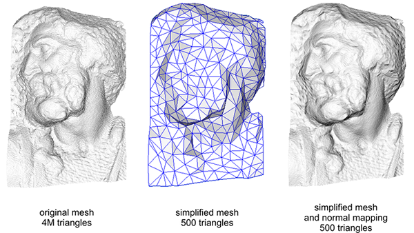
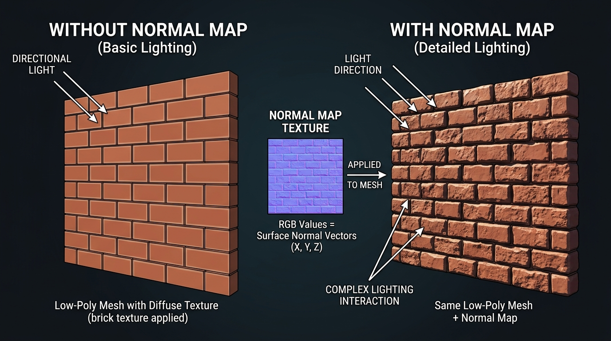
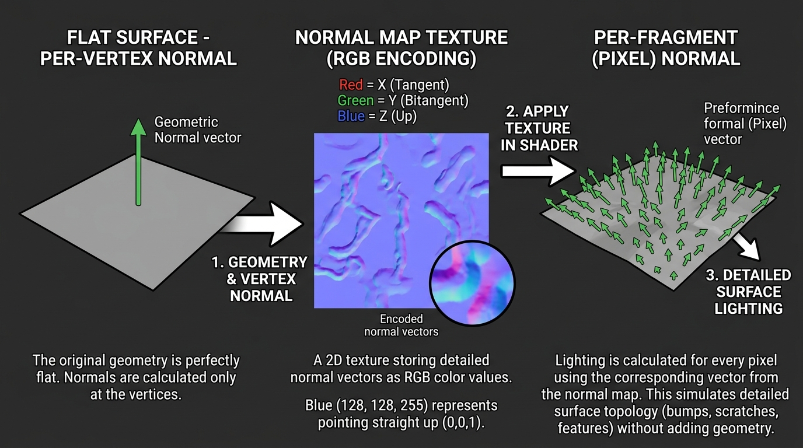
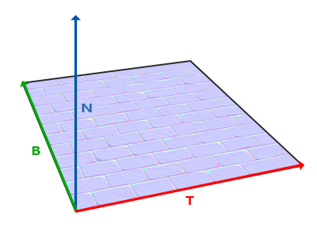
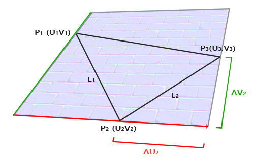
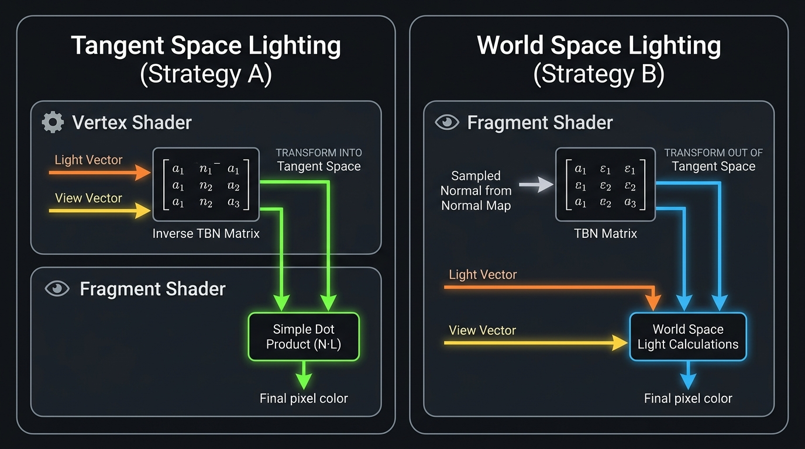
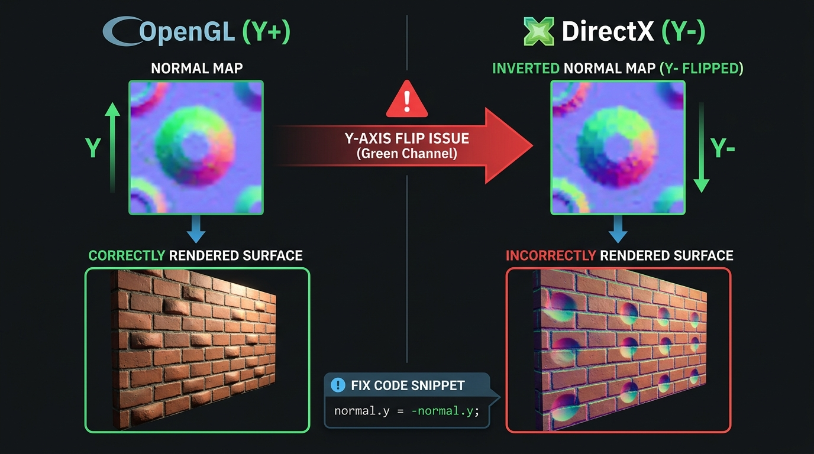

# 遊戲開發 - 法線貼圖 Normal Mapping



在 3D 繪圖中，物體表面的光影細節（如凹凸、皺褶、裂縫）能大幅提升真實感。然而，要用幾何頂點（Vertices）來呈現這些細節，會需要極高的多邊形面數（High Poly），這對即時渲染的效能是一大負擔。

**法線貼圖 (Normal Mapping)** 是一種在低面數（Low Poly）模型上，利用特殊紋理「欺騙」光照系統、呈現高面數凹凸細節的技術。




## 法線貼圖的基本概念



在標準的光照計算中，表面的法線向量（Normal Vector）決定了光線如何反射。若整個表面共用同一個法線，光照結果自然一片平坦。法線貼圖的核心思想是：**將逐頂點（Per-vertex）的法線，替換為逐像素片段（Per-fragment）的法線。**


我們將每個像素位置的法線向量 $(X, Y, Z)$ 轉換為 $(R, G, B)$ 顏色值，儲存在一張 2D 紋理貼圖 (稱為 Normal Map) 中，如下圖為磚塊造型的法線貼圖：


*   **為什麼法線貼圖看起來是偏藍紫色的？**
    法線向量的範圍是 $[-1, 1]$，存入圖片時會被映射到 $[0, 1]$。大多數情況下，表面的法線是垂直向外的，也就是指向正 Z 軸 $(0, 0, 1)$。經過映射後，這個向量變成 $(0.5, 0.5, 1.0)$，在 RGB 色彩空間中呈現的就是一種偏藍紫色的視覺效果。

## 切線空間 (Tangent Space)



若法線貼圖記錄的是世界或模型空間的絕對方向，貼圖就只能用於特定朝向的表面；換到不同朝向的面（如立方體的六個面），法線方向就會完全錯誤，無法重複共用。為了解決這個問題，法線貼圖內的法線向量是定義在一個相對於模型表面的局部座標系中，稱為**切線空間 (Tangent Space)**。構成切線空間需要三個互相垂直的基底向量，組合成 **TBN 矩陣**：
*   **T (Tangent, X 軸)**：平行表面，對應紋理 UV 的 U 方向（水平）。
*   **B (Bitangent, Y 軸)**：平行表面，對應紋理 UV 的 V 方向（垂直）。
*   **N (Normal, Z 軸)**：垂直於表面的幾何法線。

### 切線與副切線的計算原理



法線 (N) 通常由 3D 建模軟體提供，但切線 (T) 和副切線 (B) 該如何計算？T 就是「表面上 U 座標增加的 3D 方向」，B 就是「V 座標增加的 3D 方向」。當我們沿著三角形的一條邊從 $P_1$ 走到 $P_2$ 時，UV 座標分別變化了 $\Delta U$ 和 $\Delta V$，因此這條邊可以拆解為：

$$Edge = \Delta U \cdot T + \Delta V \cdot B$$

用三角形的兩條邊列出兩個方程，就能解出 T 和 B。

```math
\begin{aligned}
Edge_1 &= \Delta U_1 \cdot T + \Delta V_1 \cdot B \\
Edge_2 &= \Delta U_2 \cdot T + \Delta V_2 \cdot B \\[6pt]
\begin{bmatrix} T \\ B \end{bmatrix}
&= \frac{1}{\Delta U_1 \Delta V_2 - \Delta U_2 \Delta V_1}
\begin{bmatrix} \Delta V_2 & -\Delta V_1 \\ -\Delta U_2 & \Delta U_1 \end{bmatrix}
\begin{bmatrix} Edge_1 \\ Edge_2 \end{bmatrix}
\end{aligned}
```

在現代遊戲引擎中，這些資料通常在模型載入階段預先計算好，作為頂點屬性（Vertex Attributes）傳入 GPU。

**省去 Bitangent 頂點屬性**：T、B、N 互相垂直，只要有 T 和 N 就能在 Vertex Shader 中用外積算出 B，不需額外佔用 VBO 頻寬：
```glsl
vec3 B = cross(N, T);
```

## Shader 實作邏輯



在渲染管線中實作 Normal Mapping，有兩種空間轉換策略：
1.  將光源與視角從「世界空間」轉換到「切線空間」，在切線空間中做光照。
2.  將法線從「切線空間」轉換到「世界空間」，在世界空間中做光照。

### 切線空間光照（Forward Shading 常用）

在 Vertex Shader 中將光源和視角向量轉換到切線空間，Fragment Shader 只需單純內積運算。因為 Vertex 數量遠少於 Fragment，矩陣乘法集中在 VS 端可節省效能。

**Vertex Shader**

注意：頂點屬性傳入的 T 和 N 處於**模型空間 (Object Space)**，必須先乘上 Normal Matrix（若無非均勻縮放可用 `mat3(model)`）轉到**世界空間**，才能與世界空間的 `lightPos` / `viewPos` 配合運算。由於模型共用頂點經平均化後 T 與 N 可能不完全互垂，建議做一次 **Gram-Schmidt 正交化**：

```glsl
// 0. 先將 T, N 從模型空間轉至世界空間
// 註：若模型有「非均勻縮放」，必須使用 Normal Matrix 轉換。
// （若確定只有均勻縮放，可簡化為 mat3(model) 以節省效能）
mat3 normalMatrix = transpose(inverse(mat3(model)));
vec3 T = normalize(normalMatrix * aTangent);
vec3 N = normalize(normalMatrix * aNormal);

// 1. Gram-Schmidt 正交化：確保 T 與 N 完全垂直
T = normalize(T - dot(T, N) * N);
vec3 B = cross(N, T); // 靠外積算出 B

// 2. 建立 TBN 矩陣，用轉置取代繁重的矩陣求逆（正交矩陣的逆 = 轉置）
mat3 TBN = transpose(mat3(T, B, N));

// 3. 將光照與視角向量轉換至切線空間，傳遞給 Fragment Shader
// 註：交由 Rasterizer 線性插值時，在大曲面多邊形上可能會產生輕微的光照失真 (Interpolation Artifact)
TangentLightPos = TBN * lightPos;
TangentViewPos  = TBN * viewPos;
TangentFragPos  = TBN * vec3(model * vec4(aPos, 1.0));
```

**Fragment Shader**

從法線貼圖採樣出顏色，還原為 $[-1, 1]$ 的法線向量，直接在切線空間中做光照計算：

```glsl
// 1. 從貼圖採樣法線 (範圍 [0,1])
vec3 normal = texture(normalMap, TexCoords).rgb;

// 2. 將法線映射回 [-1,1]
normal = normalize(normal * 2.0 - 1.0);

// 3. 在切線空間中進行常規光照計算
vec3 lightDir = normalize(TangentLightPos - TangentFragPos);
float diff = max(dot(normal, lightDir), 0.0);
// ...後續可接續計算 Specular 等
```

### 世界空間光照（PBR / Deferred Shading 標準作法）

在多光源或 Deferred Shading 架構下，G-Buffer 需要儲存世界空間的法線。此時不適合把所有光源轉到切線空間，而是反過來——在 Fragment Shader 中用 TBN 矩陣將採樣出的法線轉至世界空間。

**Vertex Shader**

將世界空間的 TBN 向量傳給 Fragment Shader（不做轉置）。

```glsl
mat3 normalMatrix = transpose(inverse(mat3(model)));
vec3 T = normalize(normalMatrix * aTangent);
vec3 N = normalize(normalMatrix * aNormal);
T = normalize(T - dot(T, N) * N);
vec3 B = cross(N, T);

vs_out.TBN = mat3(T, B, N); // 直接傳遞，不轉置
vs_out.FragPos = vec3(model * vec4(aPos, 1.0));
```

**Fragment Shader**

用 `TBN * normal` 將切線空間法線轉至世界空間，後續光照計算皆在世界空間完成。
> **註**：TBN 矩陣經過 Rasterizer 線性插值後，會微幅失去正交性與單位長度。後續的 `normalize()` 能修正法線長度，但若要求物理精確，改為在 FS 中重新建構 TBN 以避免角度偏差。

```glsl
vec3 normal = texture(normalMap, TexCoords).rgb;
normal = normalize(normal * 2.0 - 1.0);
normal = normalize(TBN * normal); // 切線空間 → 世界空間

// 在世界空間中進行光照計算（適用多光源 / Deferred Shading）
vec3 lightDir = normalize(lightPos - FragPos);
float diff = max(dot(normal, lightDir), 0.0);
```

**兩種作法比較**：

| | 作法 A（切線空間光照） | 作法 B（世界空間光照） |
|---|---|---|
| 矩陣乘法位置 | VS（每頂點一次） | FS（每片段一次） |
| 單光源效能 | ✅ 較優 | 稍差 |
| 多光源 / Deferred | 需對每個光源重複轉換 | ✅ 天然適合 |
| PBR 相容性 | 需額外處理 | ✅ G-Buffer 直接使用 |

## 實戰常見問題 (FAQ)

### 為什麼貼上去後，該凸出的地方反而凹下去？



這是遊戲業最經典的地雷：**綠色通道翻轉 (Flip Green Channel / Y+ vs Y-)**。
*   **OpenGL 系統**（含本篇範例）：法線貼圖的 Y 軸指向上方（**Y+**）。
*   **DirectX / Unreal Engine**：Y 軸指向下方（**Y-**）。

若發現法線凹凸方向上下顛倒，只需在 Shader 讀取貼圖**並映射至 $[-1, 1]$ 後，將 $Y$ 分量反轉（`normal.y = -normal.y;`）**，或在建模軟體／引擎內匯入時勾選 **Flip Green**。

### 為什麼採樣後要對法線再次 `normalize()`？

即便貼圖存的時候是單位向量，經過雙線性過濾（Bilinear Filtering）或 Mipmapping 的內插計算後，法線長度往往會略小於 1。**採樣後的二次標準化不可省略**。

## 參考延伸閱讀

[LearnOpenGL - Normal Mapping](https://learnopengl.com/Advanced-Lighting/Normal-Mapping)

[OpenGL Tutorial - Tutorial 13 : Normal Mapping](https://www.opengl-tutorial.org/intermediate-tutorials/tutorial-13-normal-mapping/)
